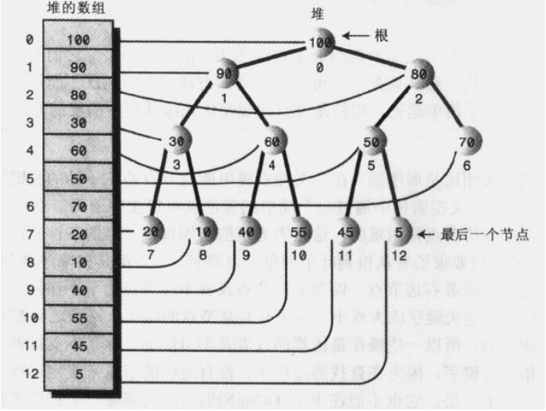

https://www.cs.usfca.edu/~galles/visualization/Heap.html

# 一、堆介绍

堆是有如下特点的二叉树：

- 它是完全二叉树。这也就是说，除了树的最后一层节点不需要是满的，其他的每一层从左到右都完全是满的。
- 它常常用一个数组实现。
- 堆中的每一个节点都满足堆的条件，也就是说每一个节点的关键字都大于（或等于）这个节点的子节点的关键字。

> 这个非常重要，要牢记。

堆和二叉搜索树相比是弱序的，在二叉搜索树种所有节点的左子孙的关键字都小于右子孙的关键字。这说明在一个二叉搜索树种通过一个简单的算法就可以按序遍历节点。

在堆中，按序遍历节点是困难的，这是因为堆的组织规则（堆的条件）比二叉搜索树的组织规则弱。对于堆来说，**只要求沿着从根到叶子的每一条路径，节点都是按降序排序的**。如图所示，指定节点的左边节点或者右边节点，以及上层节点或者下层节点由于不在同一条路径上，它们的关键可能比指定节点的关键字或大或小。除了有共享节点的路劲，路径之间都是相互独立的。

由于堆是弱序的，所以一些操作是困难或者是不可能的。除了不支持遍历以外，也不能在堆上便利地查找指定关键字，因为在查找的过程中，没有足够的信息来决定选择通过节点的两个子节点中的哪一个走向下一层。它也不能在少至O(logN)的时间内删除一个指定关键字的节点，因为没有办法找到这个节点。

因此，堆的这种组织似乎非常接近无序。不过，对于快速移除最大节点的操作以及快速插入新节点的操作，这种顺序已经足够了。这些操作是使用堆作为优先级队列时所需的全部操作。

# 二、堆实现

## 2.1. 基于数组实现

关于用数组表示一棵树的一些要点。若数组中节点的索引为x，则：

- 它的父节点的下标为(x-1)/2
- 它的左子节点的下标为2*x + 1
- 它的右子节点的下标为2*x + 2

> 注意：记住"/"这个符号，应用于整数的算式时，它执行整除，且得到的结果是下取整的值。

# 三、堆应用

java.util.TaskQueue

java.util.PriorityQueue

# 四、参考

https://www.cs.usfca.edu/~galles/visualization/Heap.html

