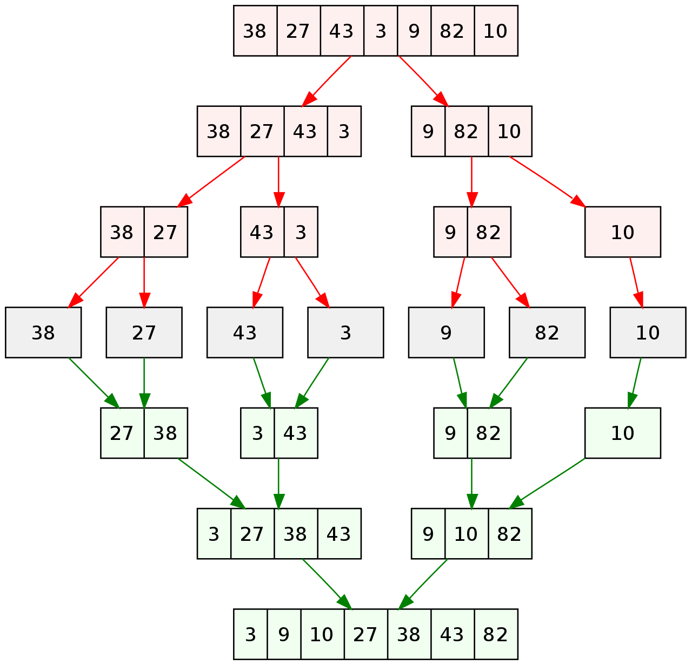

java.util.Arrays#mergeSort(java.lang.Object[], java.lang.Object[], int, int, int, java.util.Comparator)

# 描述

归并排序（MERGE-SORT）是建立在归并操作上的一种有效的排序算法,该算法是采用分治法（Divide and Conquer）的一个非常典型的应用。将已有序的子序列合并，得到完全有序的序列；即先使每个子序列有序，再使子序列段间有序。若将两个有序表合并成一个有序表，称为二路归并。

# 步骤

采用分治法：

- 分割：递归地把当前列平均分割成两半。
- 集成：在保持元素顺序的同时将上一步得到的子序列集成到一起（归并）。

# 动态图展示

# 复杂度

时间复杂度：O(nlogn)

# 代码

~~~java
import java.util.Arrays;

public class MergeSort {

    public static void mergeSort(int[] array, int start, int end) {
        if (start < end) {
            // 折半成两个小集合，分别进行递归
            int mid = (start + end) / 2;
            mergeSort(array, start, mid);
            mergeSort(array, mid + 1, end);

            // 把两个有序小集合，归并成一个大集合
            merge(array, start, mid, end);
        }
    }

    private static void merge(int[] array, int start, int mid, int end) {
        // 开辟额外大集合
        int[] tempArray = new int[end -start + 1];
        int p1 = start, p2 = mid + 1, p = 0;

        // 比较两个小集合的元素，依次放入大集合
        while (p1 <= mid && p2 <= end) {
            if (array[p1] <= array[p2]) {
                tempArray[p++] = array[p1++];
            } else {
                tempArray[p++] = array[p2++];
            }
        }

        // 左侧小集合还有剩余，依次放入大集合尾部
        while (p1 <= mid) {
            tempArray[p++] = array[p1++];
        }

        // 右侧小集合还有剩余，依次放入大集合尾部
        while (p2 <= end) {
            tempArray[p++] = array[p2++];
        }

        // 把大集合的元素复制会原数组
        for (int i=0; i<tempArray.length; i++) {
            array[i+start] = tempArray[i];
        }

    }

    public static void main(String[] args) {
        int[] array = {63, 21, 33, 70, 12, 85, 44, 3, 99, 0, 108, 36};
        mergeSort(array, 0, array.length - 1);
        System.out.println(Arrays.toString(array));
    }

}
~~~

# 参考资料

https://www.hackerearth.com/practice/algorithms/sorting/merge-sort/visualize/

