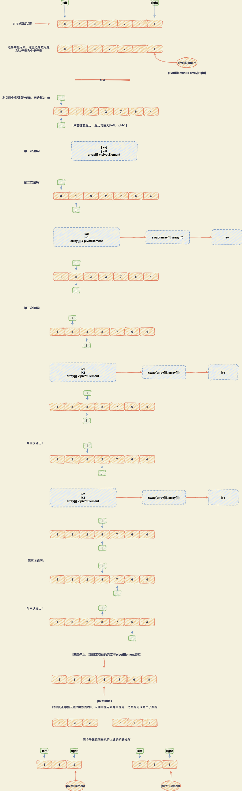
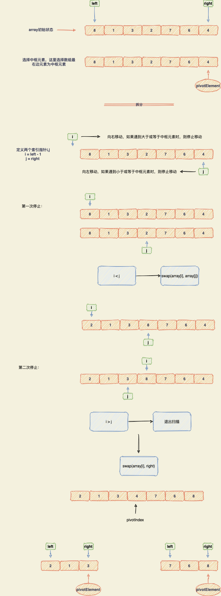

# 一、描述

快速排序（Quicksort）是对冒泡排序的一种改进。

快速排序由C. A. R. Hoare在1962年提出。它的基本思想是：通过一趟排序将要排序的数据分割成独立的两部分，其中一部分的所有数据都比另外一部分的所有数据都要小，然后再按此方法对这两部分数据分别进行快速排序，整个排序过程可以递归进行，以此达到整个数据变成有序序列。

# 二、拆分

选择出中心位元素，然后拆分成2个数组，左边小于这个中心位元素，右边大于这个中心位元素。然后再分别选择出中心位元素，再次按这个规则拆分。直到拆分至一个元素为止。

参考：https://www.toutiao.com/i6625408353226981891/

## 2.1. **单向调整**

### 图解

### 代码

~~~java
/**
 * 单向调整
 *
 * @param left
 * @param right
 * @return
 */
private int partitionV1(int left, int right, int pivotElement) {
    int i,j;
    i = left;
    for (j = left; j<right; j++) {
        if (array[j] < pivotElement) {
            swap(i, j);
            i++;
        }
    }

    array[right] = array[i];
    array[i] = pivotElement;

    return i;
}
~~~

## 2.2. 双向调整

### 图解

### 代码

~~~java
/**
 * 双向调整
 *
 * @param left
 * @param right
 * @param pivot
 * @return
 */
private int partitionV2(int left, int right, int pivot) {
    int leftPtr = left - 1;
    int rightPtr = right;
    while (true) {
        while (array[++leftPtr] < pivot)
            ;
        while (rightPtr > 0 && array[--rightPtr] > pivot)
            ;
        if (leftPtr >= rightPtr)
            break;
        else
            swap(leftPtr, rightPtr);
    }

    swap(leftPtr, right);
    return leftPtr;
}
~~~

# 三、整体代码

~~~java
public class QuickSorts {

    private int[] array;

    public QuickSorts(int[] array) {
        this.array = array;
    }

    public void quickSort() {
        recQuickSort(0, array.length - 1);
    }

    private void recQuickSort(int left, int right) {
        if (right - left <= 0) {
            return;
        } else {
            // 选择哨兵元素
            int pivotElement = array[right];
            int pivotIndex = partitionV1(left, right, pivotElement);
            recQuickSort(left, pivotIndex - 1);
            recQuickSort(pivotIndex + 1, right);
        }
    }

    /**
     * 单向调整
     *
     * @param left
     * @param right
     * @return
     */
    private int partitionV1(int left, int right, int pivotElement) {
        int i,j;
        i = left;
        for (j = left; j<right; j++) {
            if (array[j] < pivotElement) {
                swap(i, j);
                i++;
            }
        }

        array[right] = array[i];
        array[i] = pivotElement;

        return i;
    }

    /**
     * 双向调整
     *
     * @param left
     * @param right
     * @param pivot
     * @return
     */
    private int partitionV2(int left, int right, int pivot) {
        int leftPtr = left - 1;
        int rightPtr = right;
        while (true) {
            while (array[++leftPtr] < pivot)
                ;
            while (rightPtr > 0 && array[--rightPtr] > pivot)
                ;
            if (leftPtr >= rightPtr)
                break;
            else
                swap(leftPtr, rightPtr);
        }

        swap(leftPtr, right);
        return leftPtr;
    }

    private void swap(int dex1, int dex2) {
        int temp = array[dex1];
        array[dex1] = array[dex2];
        array[dex2] = temp;
    }

    public void display() {
        System.out.print("A=");
        for(int j=0; j<array.length; j++)
            System.out.print(array[j] + " ");
        System.out.println("");
    }

    public static void main(String[] args) {
        int[] array = new int[20];

        for (int i=0; i<20; i++) {
            int n = (int)(java.lang.Math.random() * 99);
            array[i] = n;
        }

        QuickSorts quickSorts = new QuickSorts(array);
        quickSorts.display();
        quickSorts.quickSort();
        quickSorts.display();
    }

}
~~~

# 四、复杂度分析

把一个n个元素的数组分割成只有一个元素的数组，那么需要且logn次。

比如：2个元素，拆分需要1次；4个元素拆分需要2次，8个元素拆分需要3次。

- 快速排序最优的情况下时间复杂度为：O( nlogn )

- 快速排序最差的情况下时间复杂度为：O( n^2 )
- 快速排序的平均时间复杂度也是：O(nlogn)

