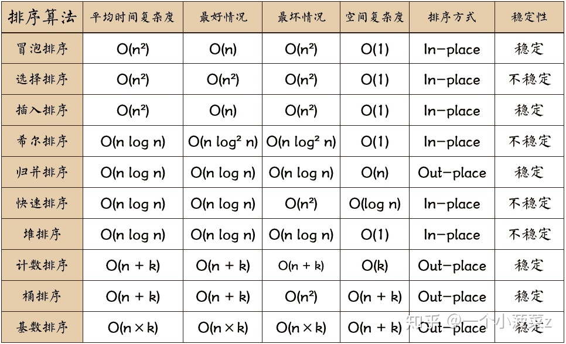

| 算法 | 最好时间 | 最坏时间 |   平均时间   | 额外空间 | 稳定性 |
| :--: | :------: | :------: | :----------: | :------: | :----: |
| 选择 |    n2    |    n2    |      n2      |    1     | 不稳定 |
| 冒泡 |    n     |    n2    |      n2      |    1     |  稳定  |
| 插入 |    n     |    n2    |      n2      |    1     |  稳定  |
| 希尔 |    n     |    n2    | n1.3(不确定) |    1     | 不稳定 |
| 归并 |  nlog2n  |  nlog2n  |    nlog2n    |    n     |  稳定  |
| 快排 |  nlog2n  |    n2    |    nlog2n    | log2n至n | 不稳定 |
|  堆  |  nlog2n  |  nlog2n  |    nlog2n    |    1     | 不稳定 |
| 基数 |   n*k    |   n*k    |     n*k      |   n+k    |  稳定  |

> 

> 无论何时，只要看到一个循环嵌套在另一个循环里，就可以怀疑这个算法的运行时间为O(N^2)级。

