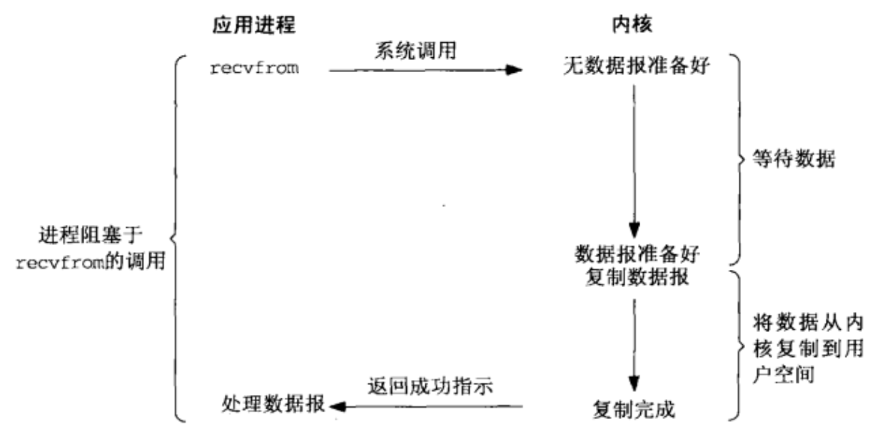
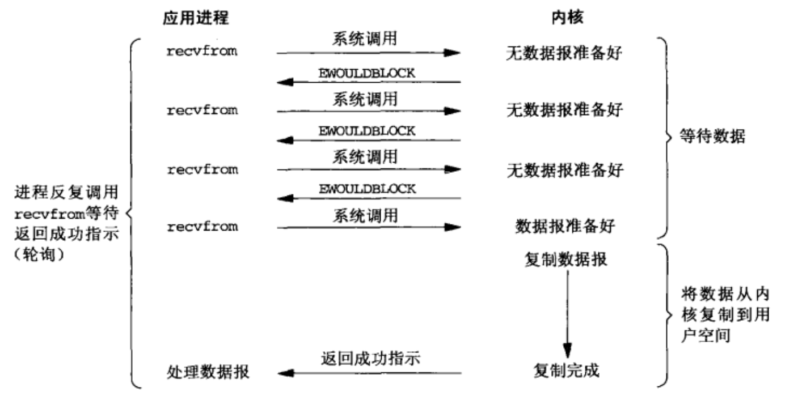
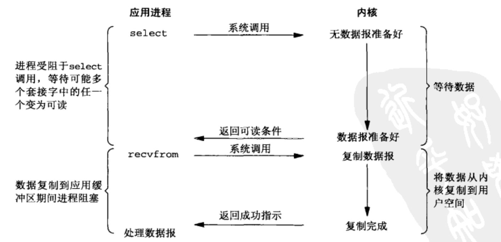

# 1.阻塞式I/O

默认情况下，所有套接字都是阻塞的。

# 2. 非阻塞式I/O

进程把一个套接字设置成非阻塞式在通知内核：当所请求的I/O操作非得把本进程投入睡眠才能完成时，不要把本进程投入睡眠，而是返回一个错误。

# 3. I/O复用（select和poll）

有了I/O复用，我们就可以调用select或poll，阻塞在这两个系统调用中的某一个上，而不是阻塞在真正的I/O系统调用上。

我们阻塞于select调用，等待数据报套接字变为可读。当select返回套接字可读这一条件时，我们调用recvfrom把所读数据报复制到应用进程缓冲区。

# 4. 信号驱动式I/O（SIGIO）

# 5. 异步I/O

