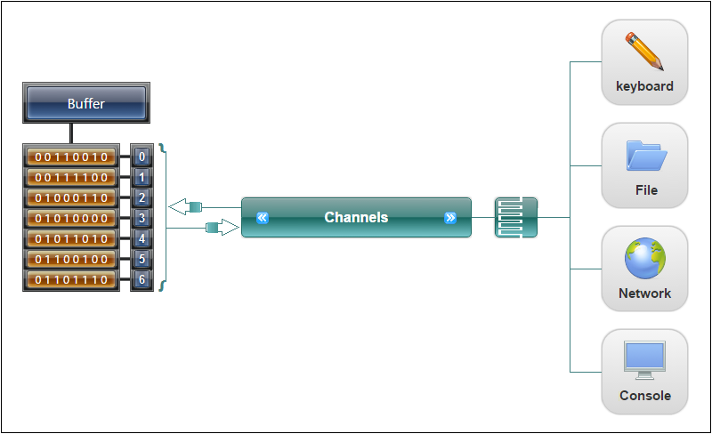

# 一、ServerSocketChannel

## 1.1. open

~~~java
ServerSocketChannel serverSocket = ServerSocketChannel.open();

public static ServerSocketChannel open() throws IOException {
    return SelectorProvider.provider().openServerSocketChannel();
}

public ServerSocketChannel openServerSocketChannel() throws IOException {
 		return new ServerSocketChannelImpl(this);
}

ServerSocketChannelImpl(SelectorProvider sp, ProtocolFamily family) {
	...
	this.fd = Net.serverSocket(family, true);
	...
}

static FileDescriptor serverSocket(ProtocolFamily family, boolean stream) {
  boolean preferIPv6 = isIPv6Available() &&
  (family != StandardProtocolFamily.INET);
  return IOUtil.newFD(socket0(preferIPv6, stream, true, fastLoopback));
}
~~~

系统调用：

~~~
#include <sys/socket.h>

int socket(int domain, int type, int protocol);
~~~

> socket() creates an endpoint for communication and returns a file descriptor that refers to that endpoint.  The file descriptor returned by a successful call will be the lowest-numbered file descriptor not currently open for the process.

## 1.2. bind

~~~
Net.bind(family, fd, isa.getAddress(), isa.getPort());
Net.listen(fd, backlog < 1 ? 50 : backlog);
~~~

~~~
#include <sys/socket.h>

int bind(int sockfd, const struct sockaddr *addr, socklen_t addrlen);           
~~~

> When a socket is created with socket(2), it exists in a name space (address family) but has no address assigned to it.  bind() assigns the address specified by addr to the socket referred to by the file descriptor sockfd.  addrlen specifies the size, in bytes, of the address structure pointed to by addr. Traditionally, this operation is called “assigning a name to a  socket”.

~~~
#include <sys/socket.h>

int listen(int sockfd, int backlog);
~~~

> listen() marks the socket referred to by sockfd as a passive socket, that is, as a socket that will be used to accept incoming connection requests using accept(2).

## 1.3. socket

Retrieves a server socket associated with this channel.

~~~java
@Override
public ServerSocket socket() {
  synchronized (stateLock) {
  if (socket == null)
  	socket = ServerSocketAdaptor.create(this);
  	return socket;
  }
}
~~~

## 1.4. configureBlocking

~~~java
/**
 * Adjust the blocking. acceptLock must already be held.
 */
private void lockedConfigureBlocking(boolean block) throws IOException {
  assert acceptLock.isHeldByCurrentThread();
  synchronized (stateLock) {
    ensureOpen();
    IOUtil.configureBlocking(fd, block);
  }
}
~~~

~~~c
static int configureBlocking(int fd, jboolean blocking)
{
    int flags = fcntl(fd, F_GETFL);
    int newflags = blocking ? (flags & ~O_NONBLOCK) : (flags | O_NONBLOCK);

    return (flags == newflags) ? 0 : fcntl(fd, F_SETFL, newflags);
}
~~~

