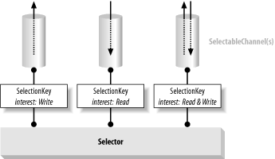

The long answer is that on Linux, with the current default implementation, it's not going to throw. If it's >= 2.6 kernel, `openSelector()` is going to instantiate and return a `EPollSelectorImpl`. If it's < 2.6 you get a `PollSelectorImpl`. Neither of those class's constructors throws an `IOException`.

