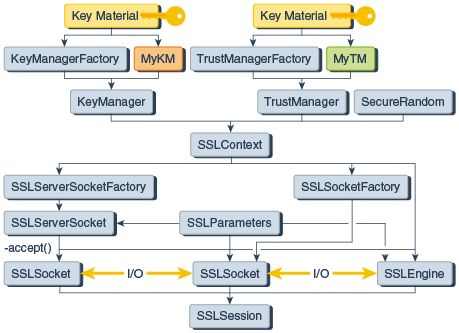

# Support Classes and Interfaces

| Engine Class Implemented | Algorithm or Protocol                                        |
| ------------------------ | ------------------------------------------------------------ |
| `KeyStore`               | PKCS12                                                       |
| `KeyManagerFactory`      | PKIX, SunX509                                                |
| `TrustManagerFactory`    | PKIX (X509 or SunPKIX), SunX509                              |
| `SSLContext`             | SSLv3([1](../SunProviders.html#enable-sslv3)), TLSv1, TLSv1.1, TLSv1.2, TLSv1.3 (since JDK 8u261 |

