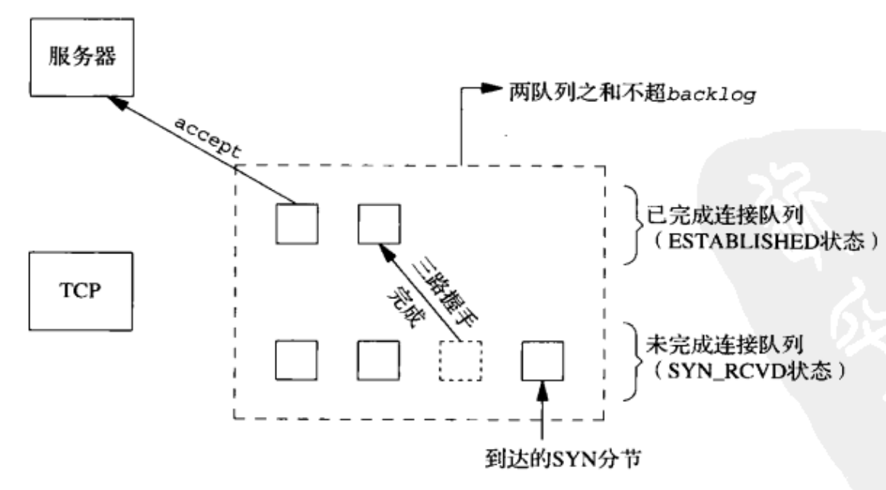

# 1. socket函数

为了执行网络I/O，一个进程必须做的第一件事就是调用socket函数，指定期望的通信协议类型（使用IPv4的TCP、使用IPv6的UDP、Unix域字节流协议等）。

~~~c
#include <sys/socket.h>
int socket(int family, int type, int protocol)
~~~

返回：若成功则为非负描述符，若出错则为-1。

socket函数在成功时返回一个小的非负整数值，它与文件描述符类似，我们把它称为套接字描述符（socket descriptor），简称sockfd。为了得到这个套接字描述符，我们只是指定了协议族（IPv4、IPv6或Unix）和套接字类型（字节流、数据报或原始套接字）。我们并没有指定本地协议地址或远程协议地址。

## 1.1. family

family参数指明协议族。该参数也往往被称为协议域。

| family   | 说明       |
| -------- | ---------- |
| AF_INET  | IPv4协议   |
| AF_INET6 | IPv6协议   |
| AF_LOCAL | Unix域协议 |
| AF_ROUTE | 路由套接字 |
| AF_KEY   | 密钥套接字 |

## 1.2. type

type参数指明套接字类型。

| type           | 说明           |
| -------------- | -------------- |
| SOCK_STREAM    | 字节流套接字   |
| SOCK_DGRAM     | 数据报套接字   |
| SOCK_SEQPACKET | 有序分组套接字 |
| SOCK_RAW       | 原始套接字     |

## 1.3. protocol

protocol参数应设为某个协议类型常值，或者设为0，以选择所给定family和type组合的系统默认值。

| protocol     | 说明         |
| ------------ | ------------ |
| IPPROTO_CP   | TCP传输协议  |
| IPPROTO_UDP  | UDP传输协议  |
| IPPROTO_SCTP | SCTP传输协议 |

# 2. connect函数

TCP客户端用connect函数来建立与TCP服务器的连接。若成功则返回0，若出错则为-1。

~~~c
#include <sys/socket.h>
int connect(int sockfd, const struct sockaddr *servadd, socklen_t addrlen)
~~~

- sockfd：由socket函数返回的套接字描述符
- servadd：套接字地址结构的指针
- addrlen：套接字地址结构的大小

套接字地址结构必须含有服务器的IP地址和端口号。

客户在调用函数connect前不必非得调用bind函数，因为如果需要的话，内核会确定IP地址，并选择一个临时端口作为源端口。

如果是TCP套接字，调用connect函数将激发TCP的三路握手过程，而且仅在连接成功或出错时才返回，其中出错返回可能有以下几种情况：

（1）若TCP客户没有收到SYN分节的响应，则返回ETIMEOUT错误。

（2）若对客户的SYN的响应是RST（表示复位），则表明该服务器主机在我们制定的端口上没有进程在等待与之连接（例如服务器进程也许没在运行）。这是一种硬错误（hard error），客户一接收到RST就马上返回ECONNREFUSED错误。

RST是TCP在发生错误时发送的一种TCP分节。产生RST的三个条件是：

- 目的地为某端口的SYN到达，然而该端口上没有正在监听的服务器；
- TCP想取消一个已有连接；
- TCP接收到一个根本不存在的连接上的分节。

（3）若客户发出的SYN在中间的某个路由器上引发一个“destination unreachable”（目的地不可达）ICMP错误，则认为是一个软错误（soft error）。客户注解内核保存该消息，并按第一种情况中所述的时间间隔继续发送SYN。若在某个规定的时间后仍未受到响应，则把保存的消息（即ICMP错误）作为EHOSTUNREACH或ENETUNREACH错误返回给进程。

按照TCP状态转换图，connect函数导致当前套接字从CLOSED状态（该套接字自从由socket函数创建一来一直所处的状态）转移为SYN_SENT状态，若成功则再转移到ESTABLISHED状态。

若connect失败则该套接字不再可用，必须关闭，我们不能对这样的套接字再次调用connect函数。

# 3. bind函数

bind函数把一个本地协议地址赋予一个套接字。对于网际网协议，协议地址是32位的IPv4地址或128位的IPv6地址与16位的TCP或UDP端口号的组合。

~~~c
#include <sys/socket.h>
int bind(int sockfd, const struct sockaddr *myaddr, socklen_t addrlen)
~~~

从bind函数返回一个常见错误是EADDRINUSE（"Address already in use"，地址已使用）。

# 4. listen函数

~~~c
#include <sys/socket.h>
int listen(int sockfd, int backlog)
~~~

返回：若成功则为0，若出错则为-1。

listen函数仅由TCP服务器调用，它做两件事情。

（1）当socket函数创建一个套接字时，它被假设为一个主动套接字，也就是说，它是一个将调用connect发起连接的客户套接字。listen函数把一个未连接的套接字转换成一个被动套接字，指示内核应接受指向该套接字的连接请求。根据TCP状态转换图，调用listen导致套接字从CLOSED状态转换到LISTEN状态。

（2）本函数的第二个参数规定了内核应该为相应套接字排队的最大连接个数。

本函数通常应该在调用socket和bind这个函数之后，并在调用accept函数之前调用。

为了理解其中的backlog参数，我们必须认识到内核为任何一个给定的监听套接字维护两个队列：

- **未完成连接队列（incomplete connection queue）**

  每个这样的SYN分节对应其中一项：已由某个客户发出并到达服务器，而服务器正在等待完成相应的TCP三路握手过程。这些套接字处于SYN_RCVD状态。

- **已完成连接队列（completed connection queue）**

  每个已完成TCP三路握手过程的客户对应其中一项。这些套接字处于ESTABLISHED状态。

当来自客户的SYN到达时，TCP在未完成连接队列中创建一个新项，然后响应以三路握手的第二个分节：服务器的SYN响应，其中捎带对客户SYN的ACK。这一项一直保留在未完成连接队列中，直到三路握手的第三个分节（客户端对服务器SYN的ACK）到达或者该项超时为止。如果三路握手正常完成，该项从未完成队列移到已完成连接队列的队尾。当进程调用accept时，已完成连接队列中的队头项将返回给进程，或者如果该队列为空，那么进程将被投入睡眠，直到TCP在该队列中放入一项才唤醒它。

当一个客户SYN到达时，若这些队列是满的，TCP就忽略该分节，也就是不发送RST。这么做是因为：这种情况是暂时的，客户TCP将重发SYN，期望不久就能在这些队列中找到可用空间。要是服务器TCP立即响应一个RST，客户的connect调用就会立即返回一个错误，强制应用处理这种情况，而不是让TCP的正常重传机制来处理。另外，客户无法区别响应SYN的RST究竟意味着“该端口没有服务在监听”，还是意味着“该端口有服务器在监听，不过它的队列满了”。

# 5. accept函数

accept函数由TCP服务器调用，用于从已完成连接队列头返回下一个已完成连接。如果已完成连接队列为空，那么进程被投入睡眠（假定套接字为默认的阻塞方式）。

~~~c
#include <sys/socket.h>
int accept(int sockfd, struct sockaddr *cliaddr, socklen_t *addrlen);
~~~

返回：若成功则为非负描述符，若出错则为-1。

# 6. close函数

通常的Unix close函数也用来关闭套接字，并终止TCP连接。

~~~c
#include <unistd.h>
int close(int sockfd);
~~~

返回：若成功则为0，若出错则为-1。

close一个TCP套接字的默认行为是把该套接字标记成已关闭，然后立即返回到调用进程。该套接字描述符不能再由调用进程使用，也就是说它不能再作为read或write的第一个参数。然而TCP将尝试发送已排队等待发送到对端的任何数据，发送完毕后发生的是正常的TCP连接终止序列。

