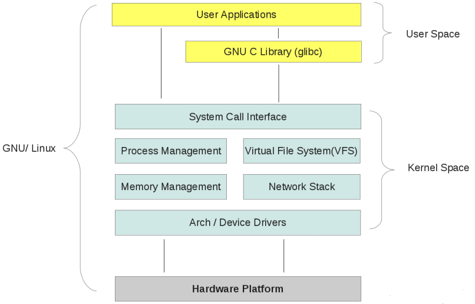
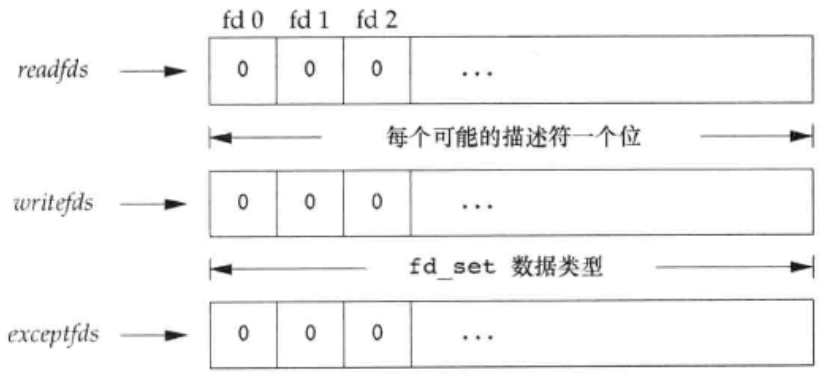
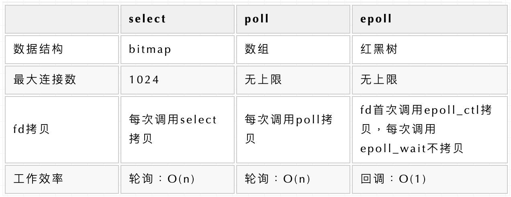

# 一、基础知识

## 1.1. 用户空间和内核空间

操作系统就是个程序，但是它具有很高的运行级别，可以操作机器的硬件资源。为了保护硬件资源的安全访问，对虚拟内存划分了两个空间。内核空间和用户空间，内核空间运行着操作系统的核心程序，而用户空间运行着应用程序。应用程序的运行级别相比内核程序要低，它无法直接操作硬件资源，要想操作硬件资源必须通过内核程序。

## 1.2. 系统调用

在计算中，系统调用是计算机程序从执行它的操作系统内核请求服务的编程方式。系统调用是程序与操作系统交互的一种方式。当计算机程序向操作系统内核发出请求时，它发出系统调用。系统调用通过应用程序接口(API)向用户程序提供操作系统的服务。它在进程和操作系统之间提供接口，以允许用户级进程请求操作系统的服务。系统调用是进入内核系统的唯一入口点。所有需要资源的程序都必须使用系统调用。

## 1.3. 中断

中断是指计算机运行过程中，出现某些意外情况需主机干预时，机器能自动停止正在运行的程序并转入处理新情况的程序，处理完毕后又返回原被暂停的程序继续运行。

# 二、重要函数

## 2.1. select

https://man7.org/linux/man-pages/man2/select.2.html

~~~c
int select(int nfds, fd_set *readfds, fd_set *writefds,
                  fd_set *exceptfds, struct timeval *timeout);
~~~

select() allows a program to monitor multiple file descriptors, waiting until one or more of the file descriptors become "ready" for some class of I/O operation (e.g., input possible).  A file descriptor is considered ready if it is possible to perform a corresponding I/O operation (e.g., read(2), or a sufficiently small write(2)) without blocking.

select() can monitor only file descriptors numbers that are less than FD_SETSIZE; poll(2) and epoll(7) do not have this limitation.  See BUGS.

When select() returns, readfds will be modified to reflect which of the file descriptors you selected which is ready for reading. You can test them with the macro FD_ISSET().

### 2.1.1. 参数

#### nfds

This argument should be set to the highest-numbered file descriptor in any of the three sets, plus 1.  The indicated file descriptors in each set are checked, up to this limit (but see BUGS).

#### readfds

The file descriptors in this set are watched to see if they are ready for reading.  A file descriptor is ready for reading if a read operation will not block; in particular, a file descriptor is also ready on end-of-file.

After select() has returned, readfds will be cleared of all file descriptors except for those that are ready for reading.

#### writefds

The file descriptors in this set are watched to see if they are ready for writing.  A file descriptor is ready for writing if a write operation will not block.  However, even if a file descriptor indicates as writable, a large write may still block.

After select() has returned, writefds will be cleared of all file descriptors except for those that are ready for writing.

#### exceptfds

The file descriptors in this set are watched for "exceptional conditions".  For examples of some exceptional conditions, see the discussion of POLLPRI in poll(2).

After select() has returned, exceptfds will be cleared of all file descriptors except for those for which an exceptional condition has occurred.

#### timeout

The timeout argument is a timeval structure (shown below) that specifies the interval that select() should block waiting for a file descriptor to become ready.  The call will block until either:

- a file descriptor becomes ready;

 - the call is interrupted by a signal handler; or

- the timeout expires.

Note that the timeout interval will be rounded up to the system clock granularity, and kernel scheduling delays mean that the blocking interval may overrun by a small amount.

If both fields of the timeval structure are zero, then select() returns immediately.  (This is useful for polling.)

If timeout is specified as NULL, select() blocks indefinitely waiting for a file descriptor to become ready.

传给select的参数告诉内核：

- 我们所关心的描述符；
- 对于每个描述符我们所关心的条件（是否想从一个给定的描述符读，是否想写一个给定的描述符，是否关心一个给定描述符的异常事件）；
- 愿意等待多长时间（可以永远等待、等待一个固定的时间或者根本不等待）。

从select返回时，内核告诉我们：

- 已准备好的描述符的总数量；
- 对于读、写或异常这三个条件中的每一个，哪些描述符已准备好。

### 2.1.2. fd_set

每个描述符集存储在一个fd_set数据类型中。这个数据类型是由实现选择的，它可以为每一个可能的描述符保持一位。我们可以认为它只是一个很大的字节数组。

#### 文件描述符集合操作

文件描述符集的内容可以使用以下宏操作:

##### FD_ZERO()

This macro clears (removes all file descriptors from) set.  It should be employed as the first step in initializing a file descriptor set.

将一个fd_set变量的所有位设置为0。

#####        FD_SET()

This macro adds the file descriptor fd to set.  Adding a file descriptor that is already present in the set is a no-op, and does not produce an error.

#####        FD_CLR()

This macro removes the file descriptor fd from set.  Removing a file descriptor that is not present in the set is a no-op, and does not produce an error.

#####        FD_ISSET()

select() modifies the contents of the sets according to the rules described below.  After calling select(), the FD_ISSET() macro can be used to test if a file descriptor is still present in a set.  FD_ISSET() returns nonzero if the file descriptor fd is present in set, and zero if it is not.

### 2.1.3. 返回值

select有3个可能的返回值。

（1）返回值-1表示出错。这是可能发生的，例如，在所指定的描述符一个都没准备好时捕捉到一个信号。在此种情况下，一个描述符集都不修改。

（2）返回值0表示没有描述符准备好。若指定的描述符一个都没准备好，指定的时间就过了，那么就会发生这种情况。此时，所有描述符集都会置为0。

（3）一个正返回值说明了已经准备好的描述符集。该值是3个描述符集中已准备好的描述符数之和，所以如果同一描述符已准备好读和写，那么在返回值中会对其计两次数。在这种情况下，3个描述符集中仍旧打开的位对应于已准备好的描述符。

### 2.1.4. 描述符就绪条件

**1.	满足下列四个条件中的任何一个时，一个套接字准备好读。**

a.	该套接字接收缓冲区中的数据字节数大于等于套接字接收缓冲区低水位标记的当前大小。对这样的套接字执行读操作不会阻塞并返回一个大于0的值（也就是返回准备好读入的数据）。我们可以使用SO_RECVLOWAT套接字选项设置该套接字的低水位标记。对于TCP和UDP套接字而言，其默认值为1。

b.	该连接的读半部关闭（也就是接收了FIN的TCP连接）。对这样的套接字的读操作将不阻塞并返回0（也就是返回EOF）。

c.	该套接字时一个监听套接字且已完成的连接数不为0。对这样的套接字的accept通常不会阻塞。

d.	其上有一个套接字错误待处理。对这样的套接字的读操将不阻塞并返回-1（也就是返回一个错误），同时把errno设置成确切的错误条件。这些待处理错误（pending error）也可以通过指定SO_ERROR套接字选项调用getsockopt获取并清除。

**2. 下列四个条件中的任何一个满足时，一个套接字准备好写。**

a.	该套接字发送缓冲区的可用空间字节大于等于套接字发送缓冲区低水位标记的当前大小，并且或者该该套接字已连接，或者该套接字不需要连接（如UDP套接字）。这意味着如果我们把这样的套接字设置为非阻塞，写操作将不阻塞并返回一个正值（例如由传输层接受的字节数）。我们可以使用SO_SEDLOWAT套接字选项来设置该套接字的低水位标记。对于TCP和UDP套接字而言，其默认值通常为2048。

b.	该连接的写半部关闭。对这样的套接字的写操作将产生SIGPIPE信号。

c.	使用非阻塞式connect的套接字已建立连接，或者connect已经以失败告终。

d.	其上有一个套接字错误待处理。对这样的套接字的写操作将不阻塞并返回-1（也就是返回一个错误），同时把errno设置成确切的错误条件。这些待处理的错误也可以通过指定SO_ERROR套接字选项调用getsockopt获取并清除。

**3. 如果一个套接字存在带外数据或者仍处于带外标记，那么它有异常条件待处理。**

## 2.2. poll

~~~c
int poll(struct pollfd *fds, nfds_t nfds, int timeout);
~~~

poll() performs a similar task to select(2): it waits for one of a set of file descriptors to become ready to perform I/O.  The Linux-specific epoll(7) API performs a similar task, but offers features beyond those found in poll().

The set of file descriptors to be monitored is specified in the fds argument, which is an array of structures of the following form:

    struct pollfd {
        int   fd;         /* file descriptor */
        short events;     /* requested events */
        short revents;    /* returned events */
    };

The caller should specify the number of items in the fds array in nfds.

The field fd contains a file descriptor for an open file.  If this field is negative, then the corresponding events field is ignored and the revents field returns zero.  (This provides an easy way of ignor-ing a file descriptor for a single poll() call: simply negate the fd field.  Note, however, that this technique can't be used to ignore file descriptor 0.)

The field events is an input parameter, a bit mask specifying the events the application is interested in for the file descriptor fd. This field may be specified as zero, in which case the only events that can be returned in revents are POLLHUP, POLLERR, and POLLNVAL (see below).

The field revents is an output parameter, filled by the kernel with the events that actually occurred.  The bits returned in revents can include any of those specified in events, or one of the values POLLERR, POLLHUP, or POLLNVAL.  (These three bits are meaningless in the events field, and will be set in the revents field whenever the corresponding condition is true.)

If none of the events requested (and no error) has occurred for any of the file descriptors, then poll() blocks until one of the events occurs.

The timeout argument specifies the number of milliseconds that poll() should block waiting for a file descriptor to become ready.  The call
will block until either:

- a file descriptor becomes ready;

- the call is interrupted by a signal handler; or

- the timeout expires.

Note that the timeout interval will be rounded up to the system clock granularity, and kernel scheduling delays mean that the blocking interval may overrun by a small amount.  Specifying a negative value in timeout means an infinite timeout.  Specifying a timeout of zero causes poll() to return immediately, even if no file descriptors are ready.

### 参数

第一个参数是指向一个结构数组第一个元素的指针。每个数组元素都是一个pollfd结构，用于指定测试某个给定描述符fd的条件。

### 返回值

On success, poll() returns a nonnegative value which is the number of elements in the pollfds whose revents fields have been set to a nonzero value (indicating an event or an error).  A return value of zero indicates that the system call timed out before any file descriptors became read.

On error, -1 is returned, and errno is set to indicate the cause of the error.

### select vs poll

尽管它们完成一样的工作，但poll()系统调用仍然优于select()：

1. poll()无需使用者计算最大的文件描述符值加一和传递该参数；
2. poll()在应对较大值的文件描述符时更具效率。想象一下用select()监视值为900的文件描述符——内核需要检查集合中的每个比特位，知道第九百个。
3. select()的文件描述符集合是静态大小的，所以要作出权衡：要么集合很小，限制了select()可以监视的文件描述符的最大值，要么较大，但是效率不高。尤其是当不能确定集合的组成是否稀疏时，对较大位掩码的操作效率不高。使用poll()可以创建合适大小的数组。只需要监视一项或仅仅传递一个结构体。
4. 若用select()，文件描述符集合会在返回时重新创建，这样的话之后每个调用都必须重新初始化它们。poll()系统调用分离了输入（events字段）和输出（revents）字段，数组无需改变即而重用。
5. select()的timeout参数在返回时是未定义的。可移植的代码需要重写初始化它。然而pselect()没有这个问题。

但是select()系统调用的确有几个不错的地方：

- poll()由于某些Unix系统不支持poll()，所以select()的可移植性更好。
- select()提供了更好的超时方案：直到微妙级。ppoll()和pselect()在理论上都提供纳秒级的精度，但在实际中，没有任何调用可以可靠的提供哪怕是微妙级的精度。

## 2.3. epoll

~~~c
#include <sys/epoll.h>

// 数据结构
// 每一个epoll对象都有一个独立的eventpoll结构体
// 用于存放通过epoll_ctl方法向epoll对象中添加进来的事件
// epoll_wait检查是否有事件发生时，只需要检查eventpoll对象中的rdlist双链表中是否有epitem元素即可
struct eventpoll {
    /*红黑树的根节点，这颗树中存储着所有添加到epoll中的需要监控的事件*/
    struct rb_root  rbr;
    /*双链表中则存放着将要通过epoll_wait返回给用户的满足条件的事件*/
    struct list_head rdlist;
};

// API

int epoll_create(int size); // 内核中间加一个 ep 对象，把所有需要监听的 socket 都放到 ep 对象中
int epoll_ctl(int epfd, int op, int fd, struct epoll_event *event); // epoll_ctl 负责把 socket 增加、删除到内核红黑树
int epoll_wait(int epfd, struct epoll_event * events, int maxevents, int timeout);// epoll_wait 负责检测可读队列，没有可读 socket 则阻塞进程
~~~

The epoll API performs a similar task to poll(2): monitoring multiple file descriptors to see if I/O is possible on any of them.  The epoll API can be used either as an edge-triggered or a level-triggered
interface and scales well to large numbers of watched file descriptors.

The central concept of the epoll API is the epoll instance, an in-kernel data structure which, from a user-space perspective, can be considered as a container for two lists:

- The interest list (sometimes also called the epoll set): the set of file descriptors that the process has registered an interest in monitoring.

- The ready list: the set of file descriptors that are "ready" for I/O.  The ready list is a subset of (or, more precisely, a set of references to) the file descriptors in the interest list.  The ready list is dynamically populated by the kernel as a result of I/O activity on those file descriptors.

The following system calls are provided to create and manage an epoll instance:

- epoll_create(2) creates a new epoll instance and returns a file descriptor referring to that instance.  (The more recent epoll_create1(2) extends the functionality of epoll_create(2).)
- Interest in particular file descriptors is then registered via epoll_ctl(2), which adds items to the interest list of the epoll instance.
- epoll_wait(2) waits for I/O events, blocking the calling thread if no events are currently available.  (This system call can be thought of as fetching items from the ready list of the epoll instance.)

由于poll()和select()的局限，2.6内核引入了event poll(epoll)机制。虽然比前两个实现复杂了很多，epoll解决了它们共有的基本性能问题，并增加了一些新的特性。

poll()和select()每次调用时都需要所有被监听的文件描述符。内核必须遍历所有被监视的文件描述符。当这个表变得很大时——包含上百，甚至上千文件描述符时——每次调用时的遍历就成为了明显的瓶颈。

epoll把监听注册从实际监听中分离出来，从而解决了这个问题。一个系统调用初始化一个epoll上下文，另一个从上下文中加入或删除需要监视的文件描述符，第三个执行真正的时间等待（event wait）。

### 返回值

When successful, epoll_wait() returns the number of file descriptors ready for the requested I/O, or zero if no file descriptor became ready during the requested timeout milliseconds.  When an error occurs, epoll_wait() returns -1 and errno is set appropriately.

### **epoll使用示例**

~~~c
int main(int argc, char* argv[])
{
   /*
   * 在这里进行一些初始化的操作，
   * 比如初始化数据和socket等。
   */

    // 内核中创建ep对象
    epfd=epoll_create(256);
    // 需要监听的socket放到ep中
    epoll_ctl(epfd,EPOLL_CTL_ADD,listenfd,&ev);
 
    while(1) {
      // 阻塞获取
      nfds = epoll_wait(epfd,events,20,0);
      for(i=0;i<nfds;++i) {
          if(events[i].data.fd==listenfd) {
              // 这里处理accept事件
              connfd = accept(listenfd);
              // 接收新连接写到内核对象中
              epoll_ctl(epfd,EPOLL_CTL_ADD,connfd,&ev);
          } else if (events[i].events&EPOLLIN) {
              // 这里处理read事件
              read(sockfd, BUF, MAXLINE);
              //读完后准备写
              epoll_ctl(epfd,EPOLL_CTL_MOD,sockfd,&ev);
          } else if(events[i].events&EPOLLOUT) {
              // 这里处理write事件
              write(sockfd, BUF, n);
              //写完后准备读
              epoll_ctl(epfd,EPOLL_CTL_MOD,sockfd,&ev);
          }
      }
    }
    return 0;
}

~~~

### **epoll缺点**

epoll只能工作在linux下。

### **epoll LT 与 ET模式的区别**

> 该术语来自电气工程领域。
>
> - 水平触发在一个状态发生时触发。边沿触发只有在状态改变时才会产生。
> - 水平触发在只关心状态时有用。边沿触发则在关心事件本身时有用。

- epoll有EPOLLLT和EPOLLET两种触发模式，LT是默认的模式，ET是“高速”模式。
- LT模式下，只要这个fd还有数据可读，每次 epoll_wait都会返回它的事件，提醒用户程序去操作。
- ET模式下，它只会提示一次，直到下次再有数据流入之前都不会再提示了，无论fd中是否还有数据可读。所以在ET模式下，read一个fd的时候一定要把它的buffer读完，或者遇到EAGAIN错误。

Level_triggered(水平触发)：当被监控的文件描述符上有可读写事件发生时，epoll_wait()会通知处理程序去读写。如果这次没有把数据一次性全部读写完(如读写缓冲区太小)，那么下次调用 epoll_wait()时，它还会通知你在上没读写完的文件描述符上继续读写，当然如果你一直不去读写，它会一直通知你！！！如果系统中有大量你不需要读写的就绪文件描述符，而它们每次都会返回，这样会大大降低处理程序检索自己关心的就绪文件描述符的效率！！！

Edge_triggered(边缘触发)：当被监控的文件描述符上有可读写事件发生时，epoll_wait()会通知处理程序去读写。如果这次没有把数据全部读写完(如读写缓冲区太小)，那么下次调用epoll_wait()时，它不会通知你，也就是它只会通知你一次，直到该文件描述符上出现第二次可读写事件才会通知你！！！这种模式比水平触发效率高，系统不会充斥大量你不关心的就绪文件描述符！！！

## 2.4. **select/poll/epoll之间的区别**

参考：

https://juejin.im/post/6844904200141438984

https://www.jianshu.com/p/dfd940e7fca2

https://www.ibm.com/support/knowledgecenter/ssw_ibm_i_72/rzab6/xnonblock.htm

https://mp.weixin.qq.com/s/Qpa0qXxuIM8jrBqDaXmVNA

