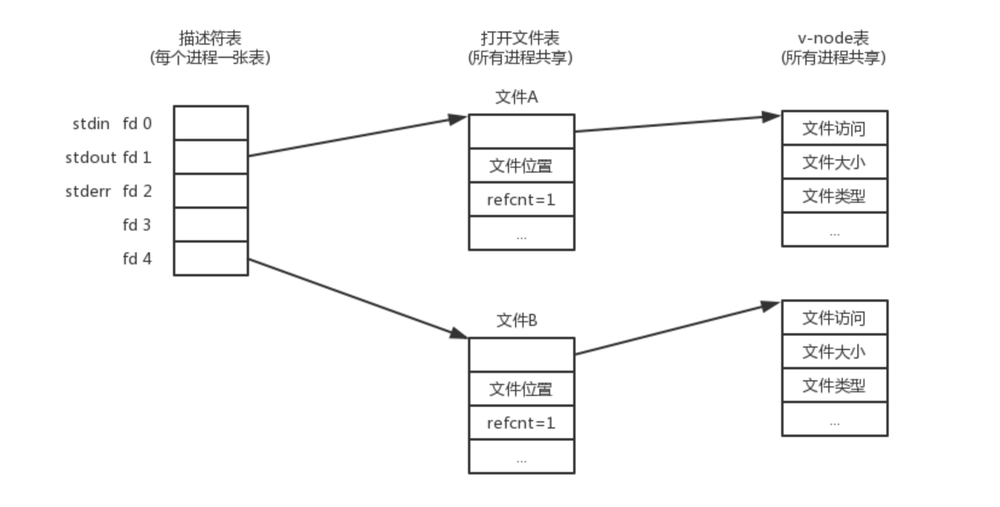
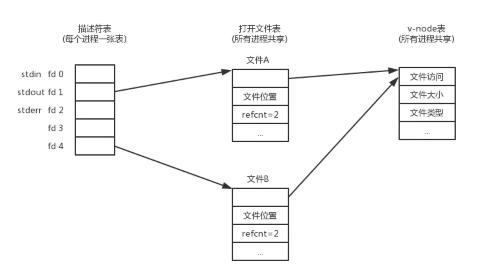
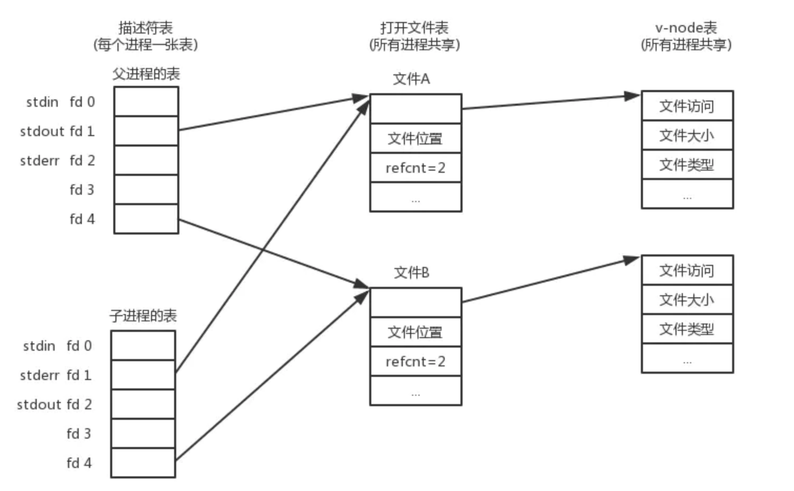
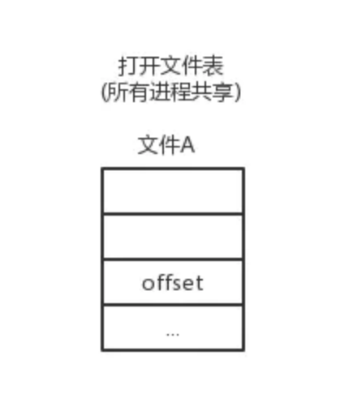

# 一、打开文件和关闭文件

所有的I/O设备(例如网络、磁盘和终端)都被模型化为文件，而所有的输入和输出都被当作对相应文件的读和写来执行。文件必须被打开才能被访问。打开一个文件具体指的是什么呢？我们知道要想操作一个实体，在编程的角度来看要持有这个实体的指针或者是引用。那么操作文件的话，同样如此。而文件属于硬件资源，用户空间内的进程是无法直接操纵的，也就是说我们的程序代码中无法直接持有某个代表文件的引用，然后直接对这个引用进行操作。对系统资源的访问通常通过内核代码来完成，文件的操作也是如此，从这一角度来看用户空间内的进程代码其实没必要直接操作文件，而是借助于内核代码来完成。内核代码替我们来完成文件的操作，而系统中的文件是非常多的，用户空间的代码通常操作的是指定的文件，那么在代码中就要明确地指定要操作哪个文件。

也就是文件必须有一个标识符，这个标识符就代表这个文件，用户空间代码在执行系统调用时会传递这个标识符给内核，内核就可以明确得知道要操作哪个文件。

一个应用程序通过要求内核打开相应地文件，来宣告它想要访问一个I/O设备。内核返回一个小的非负整数，叫做描述符，它在后续对此文件的所有操作中标识这个文件。内核记录有关这个打开文件的所有信息。应用程序需要记住这个描述符。

也就是说，打开文件就是指为了操作文件，应用空间代码必须首先持有对应文件的"标识"，而这个标识的获取是通过内核代码来完成的，内核代码记录打开文件的所有信息，然后返回一个称作为文件描述符的非负整数。这个整数就是文件的"标识"。当内核代码返回正确的文件描述符，则表示文件被用户空间代码持有，文件被打开，应用程序记住这个描述符，可以做后续的文件操作。

内核代码记录打开文件的所有信息是通过三个相关的数据结构来完成的：

- 描述符表(descriptor table)

  每个进程都有它独立的描述符表，它的表项是由进程打开的文件描述符来索引的。每个打开的描述符表项指向文件表中的一个表项。

- 文件表(file table)

  打开文件的集合是由一张文件表来表示的。所有进程共享这张表。每个文件表的表项组成(针对我们的目的)包括当前的文件位置、引用计数(reference count)(即当前指向该表项的描述符表项数)、以及一个指向v-node表中对应表项的指针。关闭一个描述符会减少相应地文件表表项中的引用计数。内核不会删除这个文件表表项，直到它的引用计数为零。

- v-node表(v-node mode)

  同文件表一样，所有的进程共享这张v-node表。每个表项包含stat结构中的大多数信息，包括st_mode和st_size成员。

下图展示了一个示例，其中描述符1和描述符4通过不同的打开文件表表项来引用两个不同的文件。

多个描述符也可以通过不同的文件表表项来引用同一个文件。例如，如果以同一个filename调用open函数两次，就会发生这种情况。关键思想是每个文件描述符都有它自己的文件位置，所以对不同描述符的读操作可以从文件的不同位置获取数据。

我们也能理解父子进程是如何共享文件的。假设在调用fork之前，父进程有如文件-1所示的打开文件。然后，文件-3展示了调用fork后的情况。子进程有一个父进程描述符表的副本。父子进程共享相同的打开文件表集合，因此共享相同的文件位置。一个很重要的结果就是，在内核删除相应文件表表项之前，父子进程必须都关闭了它们的描述符。

程序完成对某个文件的操作后，可以使用close()系统调用将文件描述符和对应的文件解除关联。close()调用解除了已打开的文件描述符的关联，并分离进程和文件的关联。给定的文件描述符不再有效，内核可以随意将其作为随后的open()或creat()调用的返回值而重新使用。

## 1.1. 不关闭文件带来的问题

那么不关闭文件会有什么后果呢？主要有以下几个问题：

- 系统资源浪费

  上面已经说过了，内核会记录打开文件的所有信息，进程表的文件描述符表项记录文件描述符信息；文件表中的文件表项记录打开文件的相关信息；v-node记录文件的元数据信息。这些信息会暂存于内存中，也就是说会使用系统的内存。关闭文件会从文件描述符表中删除具体的文件描述符项；文件描述符对应的文件表项会有文件描述符的引用计数，关闭一个描述符会减少相应地文件表表项中的引用计数。内核不会删除这个文件表表项，直到它的引用计数为零。关闭文件可以释放这些数据结构所占用的内存，文件操作结束后这部分数据就无用了，不关闭这些无用数据占用内存，造成内存资源的浪费。

- 数据丢失

  带缓冲区的输出流通过刷新操作会将缓冲区中的数据写入到文件中，通常带缓冲区的输出流的缓冲区大小都是一个指定的值，超过指定值后的写入会触发自动刷新，未超过缓冲区大小则可以通过主动刷新方式将数据写入文件。若写入的数据未超过缓冲区大小而且未主动调用刷新功能，通过调用close操作也会触发刷新操作。若这种情况下未调用close操作，那么缓冲区中的数据就不会写入到文件中，造成数据丢失。也就是说close操作内部会有刷新缓冲区的功能，打开文件后关闭文件可以有效的防止未主动刷新造成的数据丢失问题。

- 持有文件锁的进程未释放锁，会导致其他进程无法操作文件

  关闭文件会释放进程对文件锁的持有权，使得其他进程可以操作文件。

- Too many open files错误

  操作系统针对一个进程分配的文件描述符表是有限大小的，因此打开不释放可能造成该表溢出。

## 1.2. GC和文件关闭

读FileInputStream和FileOutputStream源码我们可以看到类中实现了finalize方法，这个方法我们知道跟GC有关，同时我们可以看到它会帮助我们调用关闭文件的方法，那么既然有这个是不是对象被GC的时候就会打开的文件呢？也就是说我们是否可以依赖它来为我们做文件的关闭，答案是否定的，不能依靠这个方法来关闭文件。主要原因如下：

- Java语言规范不仅不保证终结方法会被及时地执行，而且根本就不保证它们会被执行；
- 假设终结方法能被执行，但是从一个对象变得不可到达开始，到它的终结方法被执行，所花费的这段时间是任意长的。这意味着，注重时间(time-critical)的任务不应该由终结方法来完成。例如，用终结方法来关闭已经打开的文件，这是严重错误，因为打开文件的描述符是一种很有限的资源。由于JVM会延迟执行终结方法，所以大量的文件会保留在打开状态，当一个程序再不能打开文件的时候，它可能会运行失败。

# 二、读文件

这里我们从系统级的角度来看一下文件的读操作。读文件会执行系统调用，由内核代码完成实际的文件内容读取操作。

最基本、也是最常见的读取文件的机制是使用read()系统调用。该系统调用在POSIX.1中定义如下：

~~~c
#include <unistd.h>

ssize_t read(int fd, void *buf, size_t len);
~~~

该系统调用从由fd指向的文件的当前偏移量至多读len个字节到buf中。成功时，将返回写入buf中的字节数。出错时则返回-1，并设置errno。fd所指文件位置指针将会向前移动，移动的长度由之前读取的字节数决定。如果无法在该文件（比如一个字符设备文件）中确定文件位置，读操作总是从"当前"位置开始。

## 2.1. 返回值

返回一个比len小的非零正整数对于read()来说是合法的。出现这种情况，可能有各种各样的原因，例如：可供读取的字节数本来就比len要少，系统调用可能被信号打断，管道可能被破坏（如果fd是个管道），等等。

另外一种需要考虑的是调用read()时返回0的情况。当已位于文件尾时，read()系统调用返回0，说明已经到达文件结尾(EOF)；这种情况下，当然没有字节被读入。EOF并不是一种错误（也因此不用返回-1）；它仅仅表示文件位置指针已经位于文件最后一个有效偏移之后，之后没有任何数据可读了。然而，如果一个调用需要读len个字节，但却没有一个字节可读，调用将阻塞（睡眠），直到那些字节可以读取为止（假设文件描述符没有在非阻塞模式下打开）。注意这与返回EOF时不同。就是，"没有数据可读"和"数据末尾"是不同的。在EOF的情况下，到达了文件末尾。在阻塞的情况下，读操作在等待更多的数据——例如在从套接字或者设备文件读取的时候。

有些错误是可以恢复的。比如，当read()调用在未读取任何字节前被一个信号打断，它会返回-1（如果为0，则可能和EOF混淆），并设置errno为EINTR。在这种情况下，你可以重新提交读取请求。

对read()的调用确实会有很多可能的结果：

- 调用返回一个等于len的值。所有len个被读取字节存储在buf中。结果和预期一致。
- 调用返回一个大于零但小于len的值。读取的字节存入buf中。这种情况出现在一个信号打断了读取过程，或在读取中发生了一个错误，有效字节大于零，但比len字节少时，或者在读入len个字节前已抵达EOF。再次进行读取（更新buf和len的值）将读入剩余字节到buf的剩余空间中，或者指出问题发生的原因。
- 调用返回0。这标志着EOF。没有可以读入的数据。
- 调用阻塞了，因为没有可用的用来读取的数据。这在非阻塞模式下不会发生。
- 调用返回-1，并且errno被设置为EINTR。这表示在读入字节之前收到了一个信号。可以重新进行调用。
- 调用返回-1，并且errno被设置为EAGAIN。这表示读取会因没有可用的数据而阻塞，而读请求应该在之后重开。这只在非阻塞模式下发生。
- 调用返回-1，并且errno被设置不同于EINTR或EAGAIN的值。这表示某种更严重的错误。

这里我们来看一下FileInputStream的read()方法。Java调用read()方法，会执行对本地方法的调用：

*jdk/src/share/native/java/io/FileInputStream.c*

~~~c
JNIEXPORT jint JNICALL
Java_java_io_FileInputStream_read(JNIEnv *env, jobject this) {
    return readSingle(env, this, fis_fd);
}
~~~

*jdk/src/share/native/java/io/io_util.c*

~~~c
jint
readSingle(JNIEnv *env, jobject this, jfieldID fid) {
    jint nread;
    char ret;
    FD fd = GET_FD(this, fid);
    if (fd == -1) {
        JNU_ThrowIOException(env, "Stream Closed");
        return -1;
    }
    nread = IO_Read(fd, &ret, 1);
    if (nread == 0) { /* EOF */
        return -1;
    } else if (nread == -1) { /* error */
        JNU_ThrowIOExceptionWithLastError(env, "Read error");
    }
    return ret & 0xFF;
}
~~~

这里处理了read()系统调用返回0和-1两种返回值。上面提到当读到达文件末尾时read系统调用会返回0，这里做了处理，本地方法返回-1作为到达文件末尾的标志，也就是说java语言层面上通过判断读字节返回的值是否为-1来判断是否读到文件末尾。

*jdk/src/solaris/native/java/io/io_util_md.h*

~~~c
ssize_t handleRead(FD fd, void *buf, jint len);
~~~

*jdk/src/solaris/native/java/io/io_util_md.c*

~~~c
ssize_t
handleRead(FD fd, void *buf, jint len)
{
    ssize_t result;
    RESTARTABLE(read(fd, buf, len), result);
    return result;
}
~~~

这里就执行了read()系统调用。

## 2.2. 读入所有字节

如果你要处理所有的错误，并且读入所有len个字节（至少读到EOF），那么之前简单的read()是不合适的。为了达到目的，你需要一个循环，和一些循环语句。

~~~c
sszie_t ret;

while(len !=0 && (ret = read(fd, buf, len)) != 0) {
    
    if (ret == -1) {
        if (errno == EINTR) 
            continue;

        perror("read");
        break;
    }

    len -= ret;
    buf += ret;
}
~~~

这段代码处理了所有五种情况。循环从fd所指的当前文件位置读入len个字节到buf中，读入会一直读完所有len个字节或者到EOF为止。如果读入了多于零但少于len个字节，从len中减去已读字节数，buf增加相应数量的字节数，并重新调用read()。如果调用返回了-1，并且errno等于EINTR，将重新调用且不更新参数。如果调用返回-1，且errno被设置为其他值，将调用perror()来向标准错误打印一条描述并终止循环。

对于上面的代码有一点需要注意一下：循环末尾对len和buf分别做加减操作，然后如果len不为0，则继续执行read操作，这时候有个问题就是读取剩下的内容，那么系统怎么知道从文件的哪里开始读呢？这里就涉及到上面提到的文件表内容。

文件表的表项中会记录一个位移信息：

文件表条目维护一个偏移量，该偏移量描述从文件中读取(或写入)了多少字节，指示下一次从何处读取/写入。例如，当文件最初打开以供读取时，偏移量为0，因为没有读取任何内容。读取10字节后，偏移量已向前移动到10字节，因为从文件中读取了10个字节。这是允许程序按顺序读取文件的机制。

下面来看一下FileInputStream中读多字节的方法：

*FileInputStream.java*

~~~c
private native int readBytes(byte b[], int off, int len) throws IOException;

public int read(byte b[]) throws IOException {
    return readBytes(b, 0, b.length);
}

public int read(byte b[], int off, int len) throws IOException {
    return readBytes(b, off, len);
}
~~~

本地方法的调用如下：

*jdk/src/share/native/java/io/FileInputStream.c*

~~~c
JNIEXPORT jint JNICALL
Java_java_io_FileInputStream_readBytes(JNIEnv *env, jobject this,
        jbyteArray bytes, jint off, jint len) {
    return readBytes(env, this, bytes, off, len, fis_fd);
}
~~~

*jdk/src/share/native/java/io/io_util.c*

~~~c
jint
readBytes(JNIEnv *env, jobject this, jbyteArray bytes,
          jint off, jint len, jfieldID fid)
{
    jint nread;
    char stackBuf[BUF_SIZE];
    char *buf = NULL;
    FD fd;

    if (IS_NULL(bytes)) {
        JNU_ThrowNullPointerException(env, NULL);
        return -1;
    }

    if (outOfBounds(env, off, len, bytes)) {
        JNU_ThrowByName(env, "java/lang/IndexOutOfBoundsException", NULL);
        return -1;
    }

    if (len == 0) {
        return 0;
    } else if (len > BUF_SIZE) {
        buf = malloc(len);
        if (buf == NULL) {
            JNU_ThrowOutOfMemoryError(env, NULL);
            return 0;
        }
    } else {
        buf = stackBuf;
    }

    fd = GET_FD(this, fid);
    if (fd == -1) {
        JNU_ThrowIOException(env, "Stream Closed");
        nread = -1;
    } else {
        nread = IO_Read(fd, buf, len);
        if (nread > 0) {
            (*env)->SetByteArrayRegion(env, bytes, off, nread, (jbyte *)buf);
        } else if (nread == -1) {
            JNU_ThrowIOExceptionWithLastError(env, "Read error");
        } else { /* EOF */
            nread = -1;
        }
    }

    if (buf != stackBuf) {
        free(buf);
    }
    return nread;
}
~~~

实际上，除了EOF，当你在读磁盘文件时，将不会遇到不足值，而且在写磁盘文件时，也不会遇到不足值。然而，如果你想创建健壮(可靠的)诸如Web服务器这样的网络应用，就必须通过反复调用read和write处理不足值，直到所需要的字节都传送完毕。

## 2.3. 非阻塞读

有时候，程序员不希望当没有可读数据时让read()调用阻塞。相反，他们倾向于在没有可读数据时，让调用立即返回。这种情况被称为非阻塞I/O；它允许应用从不阻塞的情况下进行I/O操作，如果在操作多个文件时，不至于丢失其他文件中的可用数据。

所以，还有一个errno的值需要检查：EAGAIN。像先前讨论的那样，如果给出的文件描述符在非阻塞模式下打开（open()中的O_NONBLOCK）并且没有可读数据，read()调用会返回-1，且设置errno为EAGAIN而不是阻塞掉。在进行非阻塞I/O时，你必须检查EAGAIN，否则将可能因数据缺失导致严重的错误。你可能会用到下面的代码：

~~~c
char buf[BUFSIZ];
ssize_t nr;
start:
nr = read(fd, buf, BUFSIZ);
if (nr == -1) {
    if (errno == EINTR)
        goto start; /* oh shush */
    if (errno == EAGAIN)
        /* resubmit later */
    else 
        /* error */
}
~~~

## 2.4. 写文件

最常见的写文件的系统调用是write()。write()与read()相对应，也在POSIX.1中定义。

~~~c
#include <unistd.h>

ssize_t write(int fd, const void *buf, size_t count);
~~~

一个write()调用从由文件描述符fd引用文件的当前位置开始，将buf中至多count个字节写入文件中。不支持定位的文件(像字符设备)总是从"开头"开始写。

成功时，返回写入字节数，并更新文件位置。错误时，返回-1，并将errno设置为相应地值。一个write()可以返回0，但这种返回值没有任何特殊意义；只是表示写入了零个字节。

当fd在非阻塞模式下打开是（通过设置O_NONBLOCK参数），并且发起的写操作会正常阻塞时，write()系统调用返回-1，并设置errno值为EAGAIN。请求应该在稍后重新发起。通常处理普通文件时不会出现这种事。

下面是FileOutputStream的本地写方法源码：

*jdk/src/solaris/native/java/io/FileOutputStream_md.c*

~~~c
JNIEXPORT void JNICALL
Java_java_io_FileOutputStream_write(JNIEnv *env, jobject this, jint byte, jboolean append) {
    writeSingle(env, this, byte, append, fos_fd);
}

JNIEXPORT void JNICALL
Java_java_io_FileOutputStream_writeBytes(JNIEnv *env,
    jobject this, jbyteArray bytes, jint off, jint len, jboolean append) {
    writeBytes(env, this, bytes, off, len, append, fos_fd);
}
~~~

*jdk/src/share/native/java/io/io_util.c*

~~~c
void
writeSingle(JNIEnv *env, jobject this, jint byte, jboolean append, jfieldID fid) {
    // Discard the 24 high-order bits of byte. See OutputStream#write(int)
    char c = (char) byte;
    jint n;
    FD fd = GET_FD(this, fid);
    if (fd == -1) {
        JNU_ThrowIOException(env, "Stream Closed");
        return;
    }
    if (append == JNI_TRUE) {
        n = IO_Append(fd, &c, 1);
    } else {
        n = IO_Write(fd, &c, 1);
    }
    if (n == -1) {
        JNU_ThrowIOExceptionWithLastError(env, "Write error");
    }
}

void
writeBytes(JNIEnv *env, jobject this, jbyteArray bytes,
           jint off, jint len, jboolean append, jfieldID fid)
{
    jint n;
    char stackBuf[BUF_SIZE];
    char *buf = NULL;
    FD fd;

    if (IS_NULL(bytes)) {
        JNU_ThrowNullPointerException(env, NULL);
        return;
    }

    if (outOfBounds(env, off, len, bytes)) {
        JNU_ThrowByName(env, "java/lang/IndexOutOfBoundsException", NULL);
        return;
    }

    if (len == 0) {
        return;
    } else if (len > BUF_SIZE) {
        buf = malloc(len);
        if (buf == NULL) {
            JNU_ThrowOutOfMemoryError(env, NULL);
            return;
        }
    } else {
        buf = stackBuf;
    }

    (*env)->GetByteArrayRegion(env, bytes, off, len, (jbyte *)buf);

    if (!(*env)->ExceptionOccurred(env)) {
        off = 0;
        while (len > 0) {
            fd = GET_FD(this, fid);
            if (fd == -1) {
                JNU_ThrowIOException(env, "Stream Closed");
                break;
            }
            if (append == JNI_TRUE) {
                n = IO_Append(fd, buf+off, len);
            } else {
                n = IO_Write(fd, buf+off, len);
            }
            if (n == -1) {
                JNU_ThrowIOExceptionWithLastError(env, "Write error");
                break;
            }
            off += n;
            len -= n;
        }
    }
    if (buf != stackBuf) {
        free(buf);
    }
}
~~~

