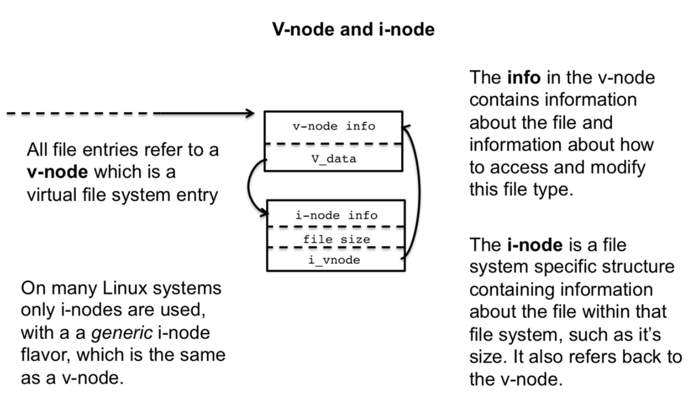

# 一、回顾：什么是文件系统？

回想一下，文件系统是将文件组织到目录和文件夹中。有许多不同类型的文件系统和许多不同的实现，它们与包含数据的存储设备紧密相连，例如，硬盘、U盘、CDrom，以及操作系统，例如Mac、Linux或Windows。

文件系统的目的是维护和组织二级存储。与不稳定且不会在计算机重新启动时持续存在的RAM不同，二级存储被设计为永久存储数据。文件系统为操作系统维护的数据布局提供了方便的表示。有各种各样的文件系统实现，它们描述了组织维护文件系统所必需的元数据的不同方法。例如，Windows上的标准文件系统类型称为NTFS，它代表Windows NT文件系统，而Linux/Unix系统的标准文件系统则根据版本的不同而被称为ext3或ext4。

OS有一个根文件系统，其中存储主数据和系统文件。在Unix系统上，这是基文件系统，由根上的单个/表示。在Windows上，这通常称为C:\drive。OS还可以挂载(mount)其他文件系统，例如插入USB驱动器或插入CD-ROM，用户可以通过文件探索访问这些其他文件系统，这些文件系统可以使用不同的布局和数据组织，例如USB驱动器上的FAT 32或光盘上的ISO 9660。

但是，从系统的编程角度来看，我们编写的程序对于文件系统的底层实现是不可知的；我们用open()打开一个文件，用read()从文件中读取数据，用write()向文件写入数据。实现的细节是完全透明的。OS是如何维持这种幻觉的？这就是下一课的主题-我们将探索文件系统的实现细节，支持我们到目前为止编写的程序。

# 二、内核（Kernel）数据结构

要理解文件系统，您必须首先考虑内核是如何组织和维护信息的。内核做了大量的工作；它需要知道哪个进程正在运行，它们的内存布局是什么，进程打开了什么文件，等等。为了支持这个，内核管理着三个重要的表/数据结构，通过这三个表来管理进程的打开文件，这三个表示：进程表，文件表，和v-node/i-node信息表。

下面我们将逐一讨论。

## 2.1. 进程表

第一个数据结构是进程表，它存储所有当前正在运行的进程的信息。这包括有关进程的内存布局、当前执行点等的信息。还包括打开的文件描述符。

As we know, all process start with with three standard files descriptors, 0, 1, 2, and these numbers and other file descriptors are indexes and stored in the open file table for that process's entry in the process table. Every time a new file is open, an new row in the open file table is added, indexed at the value of the file descriptor, e.g., 3 or 4 or 5 or etc.

打开文件表中的每一行都有两个值。第一个是描述文件的处理的标志，例如打开或关闭，或者当文件关闭时应该对其采取某些操作。第二个值是对文件表条目的引用，文件表是一个全局列表，所有进程共享，包含了当前所有打开的文件。

有关进程表条目的一个有趣的的事情是，每当进程通过fork创建子进程时，整个进程表条目都会被复制，其中包括打开的文件条目及其文件指针。这是两个进程(父进程和子进程)能够共享打开的文件。我们在前面看到了这方面的例子，我们将在后面的课中再看一遍。

## 2.2. 文件表

每当打开一个新文件时，系统范围内就会在全局文件表中创建一个新条目。这些条目在所有进程之间共享，例如，当一个文件被两个不同的进程打开时，它们可能具有相同的文件描述符号，例如3，但是每个文件描述符将引用文件描述符表中的不同条目。

每个文件表条目都包含有关当前文件的信息。最重要的是文件的状态，如文件读或写状态和其他状态信息。此外，文件表条目维护一个偏移量，该偏移量描述从文件中读取(或写入)了多少字节，指示下一次从何处读取/写入。例如，当文件最初打开以供读取时，偏移量为0，因为没有读取任何内容。读取10字节后，偏移量已向前移动到10字节，因为从文件中读取了10个字节。这是允许程序按顺序读取文件的机制。稍后，我们将看到如何操作这个偏移量并从文件的不同部分读取。

表中的最后一个条目是一个v-node指针，它是对虚拟节点(v-node)和索引节点(i-node)的引用。这两个节点包含有关如何读取文件的信息。

## 2.3. V-node和I-node表

v-nodes和i-nodes是对文件的文件系统配置和底层存储机制的引用；它将软件与硬件连接起来。例如，在某个时候，打开的文件将需要接触磁盘，但我们知道使用不同的文件系统对磁盘上的数据进行编码的方法是不同的。v-node是一种抽象机制，因此无论底层文件系统实现如何，都有一种访问该信息的统一方法，而i节点存储特定的访问信息。

查看v-node和i-node之间区别的另一种方法是，v-node就像文件系统中存在的文件一样。抽象地说，它可以是任何东西并存储在任何设备上—甚至可能不是一个文件，比如/dev/urandom或/dev/zero。相反，i-node描述如何访问该文件，包括存储在哪个设备上以及设备特定的读/写过程。

在Linux和许多Unix系统上，v-node不是显式使用的，而是只有i-node；并且，i-node可以达到双重目的。i-node既可以是文件的通用抽象表示形式，类似v-node，也可以存储设备特定的指令。我们将继续讨论v-node/i-node的区别，因为它简化了许多概念。

# 三、复习打开文件

既然我们对内核数据结构有了更好的了解，那么让我们来回顾一下文件描述符的一些常用用法，以及它如何与我们对内核数据结构的理解相匹配。

## 3.1 标准文件描述符

标准文件描述符由getty创建，并与终端设备驱动程序相关联，而且通过使用read()和write()，像其他打开文件一样使用标准文件描述符。它们必须在进程表和文件表中以及v-nodes中有条目。

然而，标准的文件描述符不是磁盘上的文件，而是与另一个设备，终端设备相关联的文件。这意味着v-node条目是指终端设备i-node，它存储使用户能够从终端读写的底层访问功能。

## 3.2 打开新文件

当我们用open()打开一个新文件时，会生成一个新的文件描述符， usually one more than the last file descriptor。还在文件描述符表中提供了一个新条目，按文件描述符号进行索引，并在打开的文件表中创建一个新条目。

如果此文件存在于磁盘上，则文件表条目将引用一个v-node，该节点引用可以从磁盘或存储该文件的特定设备读取/写入数据的i-node信息。

## 3.3. 父子进程共享文件

当进程fork时，整个进程表条目将被复制，包括所有打开的文件描述符。

但是，文件表条目中没有重复。父级和子级中的文件描述符引用相同的文件表项。请注意，文件偏移量存储在文件表条目中，因此当一个进程从文件中读取时，它会移动偏移量，而当另一个进程从文件读取时，它将开始从第一个进程停止的位置读取。

父进程和子进程都有不同的进程表项，但共享一个文件表项。子程序中的每一次读取都表示条目中的偏移量，而父项中的偏移量也是相同的。结果是父级和其子级在读取文件中的每个字节之间交替进行。

## 3.4. 复制文件

我们还研究了使用dup2()复制文件的问题，这在内核数据结构中也有一个表示。回想一下，dup2()会将一个文件描述符复制到另一个文件描述符上。

在内核数据结构中，这意味着文件描述符表中的两个条目引用相同的文件表条目。结果，对文件描述符中的任何一个的读取和写入相同，如中所示，它们引用相同的文件。

## 3.5. 管道

管道更像标准的文件描述符，因为它们不引用文件系统中的文件，而是用于在管道的写读端之间输送数据的内核数据结构。

对pipe()的调用将创建两个文件描述符，即管道两端的读和写文件描述符。这些文件描述符中的每一个都将在文件表中包含条目，但是v-node条目通过内核缓冲区链接。

