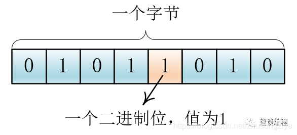
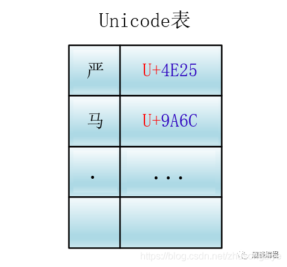
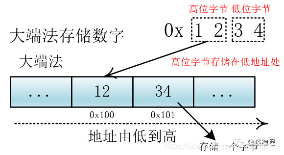
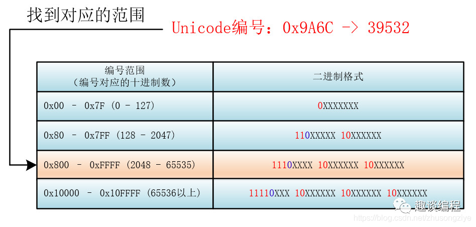
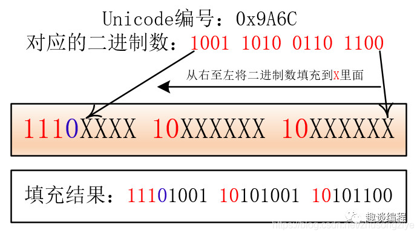

想必做过爬虫的同学肯定被编码问题困扰过，有 UTF-8、GBK、Unicode 等等编码方式，但你真的了解其中的原理吗？下面我们就来了解一下 Unicode 和 UTF-8 编码到底有什么关系。

要弄清 Unicode 与 UTF-8 的关系，我们还得从他们的来源说起，下来我们从刚开始的编码说起，直到 Unicode 的出现，我们就会感觉到他们之间的关系。

# **ASCII码**

我们都知道，在计算机的世界里，信息的表示方式只有 0 和 1,但是我们人类信息表示的方式却与之大不相同，很多时候是用语言文字、图像、声音等传递信息的。

那么我们怎样将其转化为二进制存储到计算机中，这个过程我们称之为编码。更广义地讲就是把信息从一种形式转化为另一种形式的过程。 

我们知道一个二进制有两种状态：”0” 状态 和 “1”状态，那么它就可以代表两种不同的东西，我们想赋予它什么含义，就赋予什么含义，比如说我规定，“0” 代表 “吃过了”, “1”代表 “还没吃”。

这样，我们就相当于把现实生活中的信息编码成二进制数字了，并且这个例子中是一位二进制数字，那么 2 位二进制数可以代表多少种情况能？对，是四种，2^2,分别是 00、01、10、11，那 7 种呢？答案是 2^7=128。

我们知道，在计算机中每八个二进制位组成了一个字节（Byte），计算机存储的最小单位就是字节，字节如下图所示 ：

所以早期人们用 8 位二进制来编码英文字母(最前面的一位是 0)，也就是说，将英文字母和一些常用的字符和这 128 中二进制 0、1 串一一对应起来，比如说 大写字母“A”所对应的二进制位“01000001”，转换为十六进制为 41。

在美国，这 128 是够了，但是其他国家不答应啊，他们的字符和英文是有出入的，比如在法语中在字母上有注音符号，如 é ,这个怎么表示成二进制？

所以各个国家就决定把字节中最前面未使用的那一个位拿来使用，原来的 128 种状态就变成了 256 种状态，比如 é 就被编码成 130（二进制的 10000010）。

为了保持与 ASCII 码的兼容性，一般最高为为 0 时和原来的 ASCII 码相同，最高位为 1 的时候，各个国家自己给后面的位 (1xxx xxxx) 赋予他们国家的字符意义。

但是这样一来又有问题出现了，不同国家对新增的 128 个数字赋予了不同的含义，比如说 130 在法语中代表了 é,但是在希伯来语中却代表了字母 Gimel（这不是希伯来字母，只是读音翻译成英文的形式）具体的希伯来字母 Gimel 看下图 ：

所以这就成了不同国家有不同国家的编码方式，所以如果给你一串二进制数，你想要解码，就必须知道它的编码方式，不然就会出现我们有时候看到的乱码 。

# **Unicode的出现**

Unicode 为世界上所有字符都分配了一个唯一的数字编号，这个编号范围从 0x000000 到 0x10FFFF (十六进制)，有 110 多万，每个字符都有一个唯一的 Unicode 编号，这个编号一般写成 16 进制，在前面加上 U+。例如：“马”的 Unicode 是U+9A6C。

Unicode 就相当于一张表，建立了字符与编号之间的联系：

它是一种规定，Unicode 本身只规定了每个字符的数字编号是多少，并没有规定这个编号如何存储。

有的人会说了，那我可以直接把 Unicode 编号直接转换成二进制进行存储，是的，你可以，但是这个就需要人为的规定了，而 Unicode 并没有说这样弄，因为除了你这种直接转换成二进制的方案外，还有其他方案，接下来我们会逐一看到。 

编号怎么对应到二进制表示呢？有多种方案：主要有 UTF-8，UTF-16，UTF-32。

## **UTF-32**

先来看简单的 UTF-32 

这个就是字符所对应编号的整数二进制形式，四个字节。这个就是直接转换。 比如马的 Unicode 为：U+9A6C，那么直接转化为二进制，它的表示就为：1001 1010 0110 1100。

这里需要说明的是，转换成二进制后计算机存储的问题，我们知道，计算机在存储器中排列字节有两种方式：大端法和小端法，大端法就是将高位字节放到底地址处，比如 0x1234, 计算机用两个字节存储，一个是高位字节 0x12,一个是低位字节 0x34，它的存储方式为下：

 

UTF-32 用四个字节表示，处理单元为四个字节（一次拿到四个字节进行处理），如果不分大小端的话，那么就会出现解读错误，比如我们一次要处理四个字节 12 34 56 78，这四个字节是表示 0x12 34 56 78 还是表示 0x78 56 34 12？不同的解释最终表示的值不一样。

我们可以根据他们高低字节的存储位置来判断他们所代表的含义，所以在编码方式中有 UTF-32BE 和 UTF-32LE，分别对应大端和小端，来正确地解释多个字节（这里是四个字节）的含义。

## **UTF-16** 

UTF-16 使用变长字节表示 

① 对于编号在 U+0000 到 U+FFFF 的字符（常用字符集），直接用两个字节表示。 
② 编号在 U+10000 到 U+10FFFF 之间的字符，需要用四个字节表示。

同样，UTF-16 也有字节的顺序问题（大小端），所以就有 UTF-16BE 表示大端，UTF-16LE 表示小端。

## **UTF-8** 

UTF-8 就是使用变长字节表示,顾名思义，就是使用的字节数可变，这个变化是根据 Unicode 编号的大小有关，编号小的使用的字节就少，编号大的使用的字节就多。使用的字节个数从 1 到 4 个不等。

UTF-8 的编码规则是：

**①** 对于单字节的符号，字节的第一位设为 0，后面的7位为这个符号的 Unicode 码，因此对于英文字母，UTF-8 编码和 ASCII 码是相同的。 

**②** 对于n字节的符号（n>1）,第一个字节的前 n 位都设为 1，第 n+1 位设为 0，后面字节的前两位一律设为 10，剩下的没有提及的二进制位，全部为这个符号的 Unicode 码 。

举个例子：比如说一个字符的 Unicode 编码是 130，显然按照 UTF-8 的规则一个字节是表示不了它（因为如果是一个字节的话前面的一位必须是 0），所以需要两个字节(n = 2)。

根据规则，第一个字节的前 2 位都设为 1，第 3(2+1) 位设为 0，则第一个字节为：110X XXXX，后面字节的前两位一律设为 10，后面只剩下一个字节，所以后面的字节为：10XX XXXX。

所以它的格式为 110XXXXX 10XXXXXX 。

下面我们来具体看看具体的 Unicode 编号范围与对应的 UTF-8 二进制格式 :

那么对于一个具体的 Unicode 编号，具体怎么进行 UTF-8 的编码呢？

首先找到该 Unicode 编号所在的编号范围，进而可以找到与之对应的二进制格式，然后将该 Unicode 编号转化为二进制数（去掉高位的 0），最后将该二进制数从右向左依次填入二进制格式的 X 中，如果还有 X 未填，则设为 0 。

比如：“马”的 Unicode 编号是：0x9A6C，整数编号是 39532，对应第三个范围（2048 - 65535），其格式为：1110XXXX 10XXXXXX 10XXXXXX，39532 对应的二进制是 1001 1010 0110 1100，将二进制填入进入就为： 

11101001 10101001 10101100 。

由于 UTF-8 的处理单元为一个字节（也就是一次处理一个字节），所以处理器在处理的时候就不需要考虑这一个字节的存储是在高位还是在低位，直接拿到这个字节进行处理就行了，因为大小端是针对大于一个字节的数的存储问题而言的。

综上所述，UTF-8、UTF-16、UTF-32 都是 Unicode 的一种实现。

