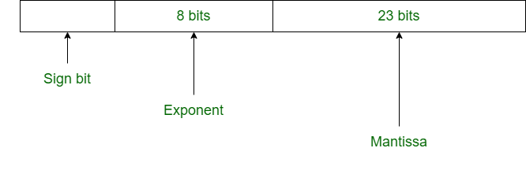
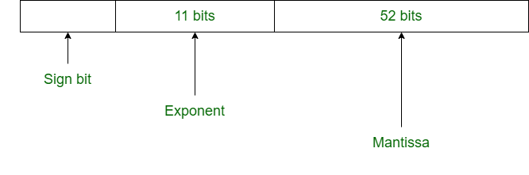

# 单精度

## 双精度

# 单精度和双精度对比

|                       SINGLE PRECISION                       |                       DOUBLE PRECISION                       |
| :----------------------------------------------------------: | :----------------------------------------------------------: |
| In single precision, 32 bits are used to represent floating-point number. | In double precision, 64 bits are used to represent floating-point number. |
|                 It uses 8 bits for exponent.                 |                It uses 11 bits for exponent.                 |
|     In single precision, 23 bits are used for mantissa.      |     In double precision, 52 bits are used for mantissa.      |
|                     Bias number is 127.                      |                     Bias number is 1023.                     |
| Range of numbers in single precision : **2^(-126)** to **2^(+127)** | Range of numbers in double precision : **2^(-1022)** to **2^(+1023)** |
|          This is used where precision matters less.          |          This is used where precision matters more.          |
|             It is used for wide representation.              |        It is used for minimization of approximation.         |
|          It is used in simple programs like games.           |  It is used in complex programs like scientific calculator.  |
|                   This is called binary32.                   |                   This is called binary64.                   |