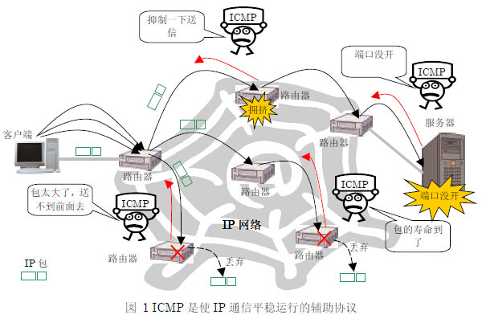

ICMP（Internet Control Message Protocol）Internet控制报文协议。它是TCP/IP协议簇的一个子协议，用于在IP主机、路由器之间传递控制信息。控制信息是指网络通不通、主机是否可达、路由是否可用等网络本身的消息。这些控制消息虽然并不传输用户数据，但是对于用户数据的传递起着重要的作用。

ICPM使用IP的基本支持，就像它是一个更高级别的协议，但是，ICMP实际上是IP的一个组成部分，必须由每个IP模块实现。

ICMP报文的种类有两种，即ICMP差错报告报文和ICMP询问报文。

# 参考

https://www.cnblogs.com/iiiiher/p/8513748.html

