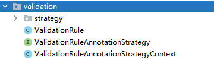

# 一、SQL优化

主要从三个方面去优化：

- 业务层优化
- 索引优化
- SQL逻辑优化

## 1.1. 业务层优化

### 按需查询

尽可能只查询需要的字段信息，避免select *。这样做的好处是避免触碰到大字段（未拆分的情况）和可以使用到覆盖索引。

> 比如：接口提供企微好友信息的查询，在没有特殊要求的情况下接口一般就只返回微信id、微信昵称、微信备注都基础信息。有特殊字段的需求开一个新接口。

### 正确设置查询字段的类型，避免隐式类型转换使得索引失效

查询有索引的字段的时候，在代码中参数的类型要与该字段的类型保持一致，避免MySQL隐式类型转换导致索引失效。

> 比如：用户绑定表中有一个bind_param的字段用于存储各对接系统的用户id，该字段类型是varchar类型，而对端业务系统传递用户id查询的时候该id是一个整型，那么在mybatis中就需要详细指定该类型的JDBC Type避免隐式类型转换使得索引失效

### 多表join能业务层面解决的就业务层面解决

> 比如：根据条件查询企微用户的好友信息，刷选条件有公共标签、私有标签、加好友时间、添加方式。查询涉及到员工表、客户表、客户公共标签表、客户私有标签表。这些表的数据量都在百万级别以上，这个时候可以不在SQL中做join取交集操作，而是在代码层查多次在内存中操作取交集。

### 善用批量插入、更新语句

MyBatis plus提供了批量插入和更新的方法，不过它的原理是批量提交单行插入的语句，这个在效率上性能比较低。需改用批量插入语句。

> 在实际的场景中测试500w条数据，插入时间大概半个小时。

### 尽量不要用模糊查询

尽量不要用模糊查询，要用的话要遵循最左匹配原则。

> 比如：产品需要做按名称模糊搜索员工的好友，这个时候为了性能考虑就做左前缀匹配。

### 使用id深度分页

> 如：有一张表存放的是公众号的数据，大概500w，有个需求需要查询这张表中哪些用户加过好友，就需要遍历这种表然后去用户表中查询是否存在好友记录，这是个后台任务，涉及到深度分页，这时候就不采用limt的方式，而是通过id>xx这种方式进行分页查询。

## 1.2. 索引优化

索引优化的目标是选择合适的列创建最优索引、删除无用索引和重复索引。

### 选择离散度比较高的列做索引

列的选择性越强，越适合创建索引。列的选择性计算公式是：

~~~
count(distinct column_name)/count(0)
~~~

当然了表设计的时候是字段哪些字段离散度比较高的。

反之，选择性比较低的列就不要创建索引。比如说客户表中的status、deleted等列就不要创建索引。

### 索引列太长使用前缀索引

索引列比较长，可考虑创建前缀索引。创建语句：

~~~
create index idx_name(column_name(pre_len))
~~~

达到pre_len的条数，如果达到总条数的80%即可。

> 备注：前缀索引无法走索引覆盖

### 使用组合索引

多列查询会一起出现的，可创建组合索引，并且将经常查的放到最前面，选择性高的放最前面。

> 比如说项目经常要根据员工号、添加微信好友时间和添加方式来查询好友列表，这个时候就可以为这三个字段创建组合索引，而且通过员工号单独查询的需求比较频繁并且员工号相对于后二个字段的选择性更高些，那么索引列的顺序依次就是员工号、添加微信好友时间和添加方式。
>
> index(A,B,C)相当于创建了index(A,B,C)、index(A,B)、index(A)三个索引。
>
> 备注：组合索引的列数不宜过多，一般2~3列即可。列过多很难用到后面的列，会增加索引的长度。

### 索引覆盖

查询的列在索引中，通过扫描索引集合获取所有的信息，不需要回表操作，效率较高。

> 比如：统计在客户表中在城市列创建索引，那么根据城市进行统计的时候，就可以进行索引覆盖，不需要回表。

### 删除无用索引

在离散度比较低的列上创建的索引，需要删除，因为索引根本就起不到作用。

### 删除重复索引

重复索引会增加存储和维护代价，可考虑删除重复索引。

> 比如index(A)和index(A,B)是重复的，可考虑删除index(A)

## 1.3.  SQL逻辑优化

### 查看执行计划

至少做到range级别。

### 避免全表扫描（type = ALL）

考虑在where和order by涉及到的列上建立索引

### 被驱动表的关联字段上创建索引

被驱动表的关联字段上创建索引，否被驱动表会走全表扫描。

> 比如：用户绑定表和用户表关联查询，查询绑定信息，用户表为驱动表，那么用户绑定表中的用户id字段就必须创建索引

### 遵循最左匹配原则

like写法只能将%放在最右边，放左边会导致索引失效。

> 这里还有一个就是多列进行查询，like条件放在最后。

### 使用union/union all来替换or连接

or会导致索引失效。

### 正确使用exists和in

区分in和exists主要是造成了驱动顺序的改变（这是性能变化的关键），如果是exists，那么以外层表为驱动表，先被访问；如果是IN，那么先执行子查询。所以IN适合外表大而内表小的情况；EXISTS适合于外表小而内表大的情况。

### 可以考虑用join/left join关联查询来替代子查询、in/not in的写法，尽量不要用子查询

如题。

# 二、分布式扣库存

TCC

# 三、订单定时取消

# 四、MySQL与Redis缓存一致性

回答出Cache Aside Pattern

首先先说更新的步骤是：先更新数据库，再删除缓存。

首先说一下4种解决方案：实时同步更新、准实时异步更新、缓存失效、任务调度更新。说说优缺点，然后就是适用场景。

完全同步是不可能的，最多只能保证强一致，然后再增加补偿机制，比如说校验之类的（场景：航程信息放在redis，可能会涉及到价格之类的变化，那么在选择航班进入乘机人填写界面的时候，就要做航程校验，创建订单的时候也做航程校验）。

缓存使用场景：航班信息（读多写少，实时同步更新或准实时异步更新）、OA架构（缓存失效）、航线信息（任务调度更新）

# 五、说说设计模式

知道哪些设计模式，哪些框架用了哪些设计模式，实际开发中用了哪些设计模式。

## 5.1. 建造者模式

案例：静态内部Builder类来构建对象。

## 5.2. 模板方法

案例：抽象模板类中定义好了操作步骤的骨架，比如说绑定操作的操作步骤依次是：根据微信id获取微信用户信息->查询该微信用户的绑定记录->根据手机号去业务系统查询业务id->执行绑定操作->发送绑定消息MQ

其中根据手机号区业务系统查询业务id这个是业务独立的，那么在模板类中其他定义其他步骤的详细实现，而把"根据手机号去业务系统查询业务id"定义成抽象的方法，由具体的子类来实现。

## 5.3. 策略模式

案例：根据选择的不同的校验规则，在动态生成实体类的时候给相应的属性条件不通过注解，定义统一的策略接口，然后实现不同的策略实现类，通过策略上下文获取不同规则下的策略。

## 5.3. 代理模式

## 5.4. 适配器

案例：service方法不支持corpId

## 5.5. 单例模式

案例：商城系统，配置信息在XML文件中，加载之后做成配置单例类。

# 六、如何检查死锁，以及解决方案

Java死锁相关、数据库死锁相关

共享锁模式容易出现死锁。因为对于共享锁模式下执行修改行操作，sessions之间会相互牵制，会相互等待其他session进行事务提交释放锁。

示例：

session1和session2都对相同的行设置了共享锁，session1准备update，此时发现session2也持有共享锁，所以等待session2释放锁，session1阻塞；session2同样准备update，此时发现session1也持有共享锁，所以等待session1释放锁。这样就形成了session1等待session2释放锁，session2等待session1释放锁的局面，这就是死锁，数据库检测到了死锁，所以session2执行update的时候就抛出了错误：

~~~java
ERROR 1213 (40001): Deadlock found when trying to get lock; try restarting transaction
~~~

此时session2的锁被释放，死锁局面解决，session1执行udpate。

解决死锁：

1. 超时
2. 顺序加锁

程序注意：

1. 注意加锁顺序
2. 加超时时间

# 七、常用的linux命令

netstat

top

tail

free

scp

ps

# 八、分布式锁实现方案

一定会说redis，然后Redis实现锁的方式，其中要考虑的问题点，已经如何解决。后面会说用到zookeeper，然后就问zookeeper实现分布式锁的原理。

redis + zookeeper

应用场景：后台任务

# 九、你们项目中哪些业务场景使用到了Redis以及各数据类型的使用场景

用Redis锁 -->over

缓存 --> over

队列 --> over

限流 --> over

# 十、分库分表

# 十一、如何打破双亲委派机制

自定义类加载器，重写loadClass方法。

场景：WebAppClassLoader

每个war（app）一个，Spring4和Spring5共存。

1. 重新loadClass方法
2. 使用线程上下文class loader

# 十二、热部署原理

答出打破双亲委派机制。

全盘负责

# 十三、熔断、降级（Hystrix）

信号隔离、线程隔离

