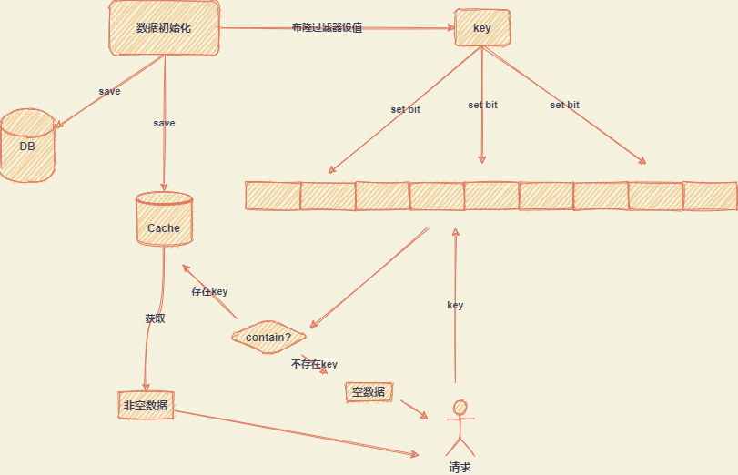

# 一、缓存穿透

## 1.1. 现象描述

缓存穿透描述的场景是：查询的数据在数据库不存在，则缓存组件中无数据缓存。这样高并发的情况下，缓存无阻拦作用，请求穿透缓存组件直接访问数据库，造成数据库高压力。

缓存穿透现象关注的是数据库数据不存在，缓存无缓存效果引起的问题。

## 1.2. 解决方案

### 1.2.1. 缓存空结果

在实际的使用场景中，通常会根据某种条件执行数据获取操作，此种条件下数据库本身就不存在数据，也就是说查询的结果返回的是空，通过该条件对应的空结果也缓存起来，来决绝缓存穿透问题。

注意：缓存空结果的键要设置过期时间，因为该条件对应的数据可能只是当前不存在，稍后会存在，如果不设置过期时间会导致该查询条件下有数据但是因为缓存原因返回空结果的情况。

示例：航班查询，根据起始地、目的地、日期查询航班，指定条件下不存在数据则在Redis中进行缓存：

~~~verilog
key -> 起始地:目的地:日期
value -> null
ttl -> 30s
~~~

### 1.2.2. 布隆过滤器

使用布隆过滤器的用法是当条件不满足则不操作数据库，将查询条件看做关键字key，执行查询的时候会查询布隆过滤器来判断该key是否存在。

这里涉及到两个操作：

1. 布隆过滤器设值操作
2. 布隆过滤器判断是否存在操作

# 二、缓存击穿

## 2.1. 现象描述

缓存击穿描述的场景是：当某个key对应的数据是非常“热点”的数据，也就是说高并发情况会有大量的请求获取该key的数据。该key的数据会缓存在缓存组件中，同时对于此key会有过期时间设置。当该key失效，缓存中不存在了，同时此时有大量的情况过来，那么就会直接请求数据库，大量请求可能会瞬间把数据库击垮，这就是缓存击穿现象。

缓存击穿的重点关注的是查询条件对应的数据存在，按理说就像一面墙一样保护对数据库的访问，但是因为缓存失效，高并发到来无法起到阻挡作用，就像墙被击穿了一样。

## 2.2. 解决方案

### 2.2.1. 永远不过期

缓存击穿现象是因为key过期而引起的现象。那么解决缓存击穿的其中一个方法就是不设置key的过期时间。

### 2.2.2. 使用互斥锁(mutex lock)

~~~java
/**
 * 获取数据
 * @param Key                     查询参数
 * @return data                   数据
 * @throws InterruptedException   异常
 * @author 敖丙
 */
public static String getData(String Key) throws InterruptedException {
    // 从redis查询数据
    String result = getDataByKV(Key);
    // 参数校验
    if (StringUtils.isBlank(result)) {
        // 获取锁
        if (reenLock.tryLock()) {
            // 去数据库查询
            result = getDataByDB(Key);
            // 校验
            if (StringUtils.isNotBlank(result)) {
                // 搞进缓存
                setDataToKV(Key, result);
            }
            // !!!释放锁 正常会在finally里面释放
            reenLock.unLock();
        } else {
            // 睡一会再拿
            Thread.sleep(100L);
            result = getData(Key);
        }
    }
    return result;
}
// 这里面的锁都是单机玩玩，分布式锁还是得靠lua脚本这样的
~~~

# 三、缓存雪崩

## 3.1. 现象描述

缓存雪崩，可以称为是缓存击穿的升级版。缓存大量的key设置了相同的过期时间，导致缓存在同一时刻全部失效，造成瞬时DB请求量大、压力骤增，引起雪崩现象。

## 3.2. 解决方案

缓存雪崩的解决的关键在于如何保证热点数据的过期时间和缓存数据库的可用性。

### 3.2.1. 设置随机的缓存时间

让缓存不在同一时间过期，设置随机的缓存过期时间包含数据库。

### 3.2.2. 热点数据永不失效

保证热点数据能一直存在于缓存中。

