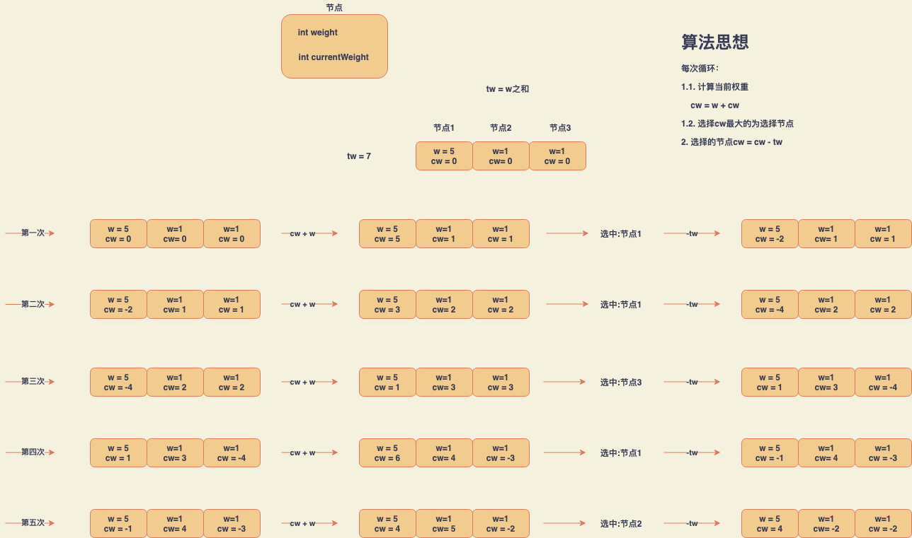

负载均衡策略：

~~~
/**
 * 负载均衡策略
 */
public interface LoadBalancerStrategy {

    T choose(List candidates);

}
~~~

# 1. 随机算法

## 1.1. 算法原理

实现原理：获取服务提供者列表大小区间之间的随机数，作为服务提供者列表的索引来获取服务。

## 1.2. 算法实现

~~~java
/**
 * 负载均衡策略 - 随机算法
 *
 * 实现原理：获取服务提供者列表大小区间之间的随机数，作为服务提供者列表的索引来获取服务
 */
public class RandomLoadBalancerStrategy<T> implements LoadBalancerStrategy<T> {

    @Override
    public T choose(List<T> candidates) {
        Random random = new Random();
        int i = random.nextInt(candidates.size());
        return candidates.get(i);
    }

}
~~~

# 2. 加权随机算法

## 2.1. 算法原理

加权随机算法在随机算法的基础上针对权重做了处理。

## 2.2. 算法实现

~~~java
package org.distributed.loadbalancer.algorithm;

import java.util.ArrayList;
import java.util.List;
import java.util.Random;

/**
 * 负载均衡策略 - 加权随机算法
 *
 * 实现原理：首先根据加权数放大服务提供者列表，比如服务提供者A加权数为3，放大之后变为A，A，A，存放在新的服务提供者列表，然后对新的服务提供者列表应用随机算法。
 */
public class WeightRandomLoadBalancerStrategy implements LoadBalancerStrategy<Server> {

    @Override
    public Server choose(List<Server> candidates) {
        // 存放加权后的服务提供者列表
        List newCandidates = new ArrayList<>();
        for (Server server : candidates) {
            int weight = server.getWeight();
            for (int i= 0; i < weight; i++) {
                Server server1 = new Server();
                server1.setUrl(server.getUrl());
                server1.setWeight(server.getWeight());
                newCandidates.add(server1);
            }
        }

        Random random = new Random();
        int i = random.nextInt(newCandidates.size());
        return newCandidates.get(i);
    }

}
~~~

# 3. 轮询算法

## 3.1. 算法原理

## 3.2. 算法实现

~~~java
/**
 * 负载均衡策略 - 轮询算法
 *
 * 实现原理：列表索引循环。
 * @param 
 */
public class RoundRobinLoadBalancerStrategy<T> implements LoadBalancerStrategy<T> {

    private AtomicInteger atomicInteger = new AtomicInteger();

    @Override
    public T choose(List<T> candidates) {
        int position = Math.abs(atomicInteger.getAndIncrement());
        return candidates.get(position % candidates.size());
    }

}
~~~

# 4. 加权轮询算法

## 4.1. 算法原理

上面轮询法不会关注服务器的性能和负载承受能力，所以在此基础上提出了加权轮询来解决平均分配请求带来的问题。主要的思想就是权重分配高的服务器处理更多的请求。

## 4.2. 算法实现

~~~java
public class Server {

    // 配置文件中指定的该后端的权重，这个值是固定不变的
    private int weight;
  
    // 当前权重。一开始为0，之后会动态调整。
    private int currentWeight = 0;

}
~~~

~~~java
/**
 * 负载均衡策略 - 平滑加权轮询算法
 * @param
 */
public class SmoothWeightedRoundRobinLoadBalancerStrategy implements LoadBalancerStrategy<Server> {

    public Server choose(List candidates) {

        int totalWeight = 0;
        int maxCurrent = Integer.MIN_VALUE;

        Server selectedServer = null;

        for (Server server : candidates) {

            // 计算当前权重
            currentWeight = server.getCurrentWeight() + server.getWeight();
            server.setCurrentWeight(currentWeight);

            // 从所有节点中选出currentWeight最大的节点，作为本次选中的节点
            if (currentWeight > maxCurrent) {
                maxCurrent = currentWeight;
                selectedServer = server;
            }

            // 总权重(weight之和)
            totalWeight += server.getWeight();
        }

        if (selectedServer != null) {
            // 被选择的节点的当前权重做减totalWeight操作
            selectedServer.setCurrentWeight(selectedServer.getCurrentWeight() - totalWeight);
            return selectedServer;
        }

        return candidates.get(0);
    }

}
~~~

https://tenfy.cn/2018/11/12/smooth-weighted-round-robin/

# 5. 源地址Hash算法

## 5.1. 算法原理

## 5.2. 算法实现

~~~java
/**
 * 负载均衡策略 - 源地址哈希算法
 */
public class SourceHashingLoadBalancerStrategy<T> implements LoadBalancerStrategy<T> {

    @Override
    public T choose(List<T> candidates) {
        return null;
    }

    public T choose(List<T> candidates, String ip) {
        int hashCode = ip.hashCode();
        int pos = hashCode % candidates.size();
        return candidates.get(pos);
    }

}
~~~

# 6. 一致性Hash算法

https://www.jianshu.com/p/d473531a55a9